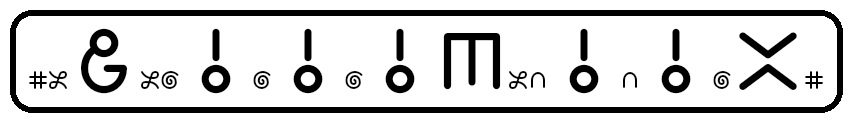
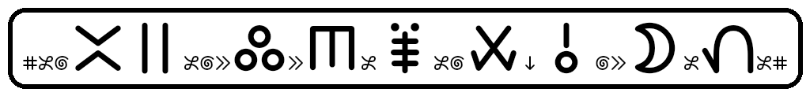
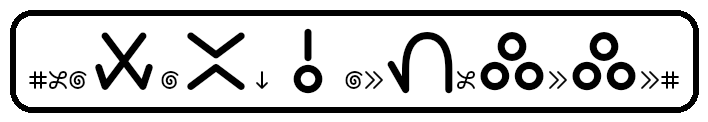
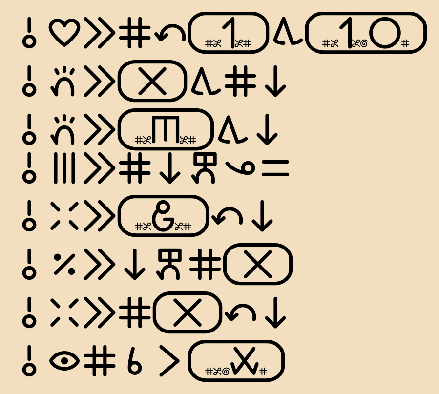
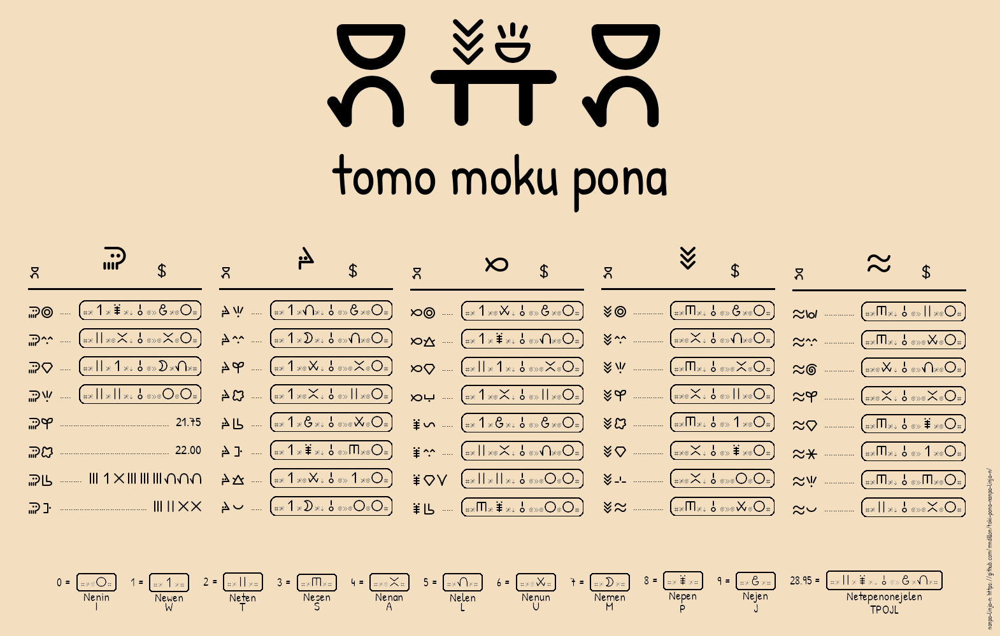

# nanpa-linja-n — A Simple, Easy Way to Communicate a String of Decimal Digits in Toki Pona

o weka e nimi ike.

## TL;DR:

**nanpa-linja-n** motivation:


### Saying the number "23,645":

| Language                 | Spoken number phrase                                 | Feels                     |
|--------------------------|------------------------------------------------------|---------------------------|
| English                  | twenty three thousand six hundred (and) forty five   | natural                   |
| French                   | vingt trois mille six cent quarante cinq             | natural                   |
| Esperanto                | dudek tri mil sescent kvardek kvin                   | natural                   |
| Lojban                   | (li) re ci xa vo mu (boi)                            | functional, sterile       |
| Toki Pona (pu)           | mute                                                 | useless                   |
| Toki Pona (nanpa pona)   | tu ale mute luka luka luka wan ale mute mute luka    | contrived, error prone    |
| Toki Pona (nanpa-linja-n)| **Netesen Eke Nunalen**                              | natural                   |

### Interactive decimal cartouche renderer:

https://mndillon.github.io/toki-pona-nanpa-linja-n/renderer.html


## Overview
**nanpa-linja-n** in sitelen pona is written using cartouches. The cartouche content is a pure encoding: it defines a unique, reversible mapping from decimal digits (and delimiters such as the decimal point) to designated sitelen pona glyphs and corresponding Latin letters, so the original decimal sequence can be reconstructed exactly.


This does **NOT** introduce any new Toki Pona words or lexicon; it is notation-only. Any “words” discussed below refer only to identifier strings / proper-name labels derived from the cartouche encoding.  When writing down a **nanpa-linja-n** proper name (in Latin script), all words will be capitalized.


Toki Pona’s vocabulary is small, but not too small.
It’s big enough to be functional while still keeping the language simple.
This system aims to follow that same idea: staying as simple as possible while still being practical for everyday use.
It’s not meant to replace anything—just to offer a tool that fits naturally into the language’s minimal design.


## Digit Symbol Words (0–9)
Each digit symbol uses a distinct, CVN form word and does not conflict with any Toki Pona words.
The digit words all start with 'ne' and have been carefully picked, so that they align with the corresponding glyphs (see below).
If we ignore 'n' and ignore 'e' in the words, then each digit word maps to a different, unique letter:

```
"0"  nenin  I
"1"  newen  W
"2"  neten  T
"3"  nesen  S
"4"  nenan  A
"5"  nelen  L
"6"  nenun  U
"7"  nemen  M
"8"  nepen  P
"9"  nejen  J
```

---

## sitelen pona digit cartouches

| Glyph                                                             | Letter       | #~n Cartouche                                                               | #~n Proper Name | Design Rationale               |
|-------------------------------------------------------------------|--------------|-----------------------------------------------------------------------------|-----------------|--------------------------------|
|        | I            |        | Nenin           | round like zero                |
|        | W            |        | Newen           | wan                            |
|     | T            |        | Neten           | tu                             |
|     | S            |     | Nesen           | has three lines                |
|     | A            |     | Nenan           | has four lines                 |
|        | L            |        | Nelen           | luka                           |
|     | U            |        | Nenun           | has six short lines            |
|     | M            |        | Nemen           | seven days in week             |
|     | P            |        | Nepen           | spiders have eight legs        |
|     | J            |        | Nejen           | nine months to carry pregnancy |

Sitelen Cartouche Summary:


**nanpa-lnja-n** unique letter to digit mapping (number → cartouche → proper name → unique number code → same number):

| digit | glyph  | cartouche letter | comments                                                                                       |
|-------|--------|------------------|------------------------------------------------------------------------------------------------|
| 0     | ijo    | i                | unique letter to digit mapping                                                                 |
| 1     | wan    | w                | unique letter to digit mapping                                                                 |
| 2     | tu     | t                | unique letter to digit mapping                                                                 |
| 3     | seli   | s                | unique letter to digit mapping                                                                 |
| 4     | awen   | a                | unique letter to digit mapping                                                                 |
| 5     | luka   | l                | unique letter to digit mapping                                                                 |
| 6     | utala  | u                | unique letter to digit mapping                                                                 |
| 7     | mun    | m                | unique letter to digit mapping                                                                 |
| 8     | pipi   | p                | unique letter to digit mapping                                                                 |
| 9     | jo     | j                | unique letter to digit mapping                                                                 |
| -     | ona    | o                | negative sign, only at start                                                                   |
| .     | o      | o                | decimal point, never at start                                                                  |
| ,     | kulupu | k                | ISO block separator                                                                            |
|       | nanpa  | n                | ignored when determining decimal value, only used to create syllables in cartouche proper name |
|       | nena   | n                | ignored when determining decimal value, only used to create syllables in cartouche proper name |
|       | nasa   | n                | ignored when determining decimal value, only used to create syllables in cartouche proper name |
|       | ni     | n                | ignored when determining decimal value, only used to create syllables in cartouche proper name |
|       | e      | e                | ignored when determining decimal value, only used to create syllables in cartouche proper name |
|       | en     | e                | ignored when determining decimal value, only used to create syllables in cartouche proper name |
|       | esun   | e                | ignored when determining decimal value, only used to create syllables in cartouche proper name |


---

## Unique Numeric Codes:
Every decimal number can be encoded into a unique cartouche.
The numeric cartouche can be spelled in Latin script as a unique proper name for the number.
The proper name for the number gives a unique abbreviation for the number.
The unique abbreviation for the number can be used to reconstruct the original number.


This gives us four uniquely decodable representations of the same underlying number: standard decimal notation, sitelen pona in a cartouche, Latin pona proper name, and a unique numeric abbreviation.


Rules:

- Take decimal number and convert to proper name using the rules below.  In sitelen pona, display the proper name in a cartouche using specific glyphs from the table above.
- Take numeric proper name, remove any letter 'n', remove any letter 'e', remove any spaces, capitalize remaining letters, add #~ at the start to produce numeric abbreviation


Example:

<div style="
  border:1px solid #d0d7de;
  border-radius:6px;
  padding:12px;
  background:#f6f8fa;
  font-family: ui-monospace, SFMono-Regular, Menlo, Monaco, Consolas, 'Liberation Mono', 'Courier New', monospace;
  font-size: 0.95em;
  line-height: 1.6;
">
  -5,432.10 →<br>
  <span style="display:inline-flex; align-items:center; gap:8px;">
    <span style="display:inline-block; transform: scale(1.4); transform-origin: left center;">#</span>
    
    <span>→</span>
  </span><br>
  nanpa Neno Len Eke Naseten One Wenin →<br>
  #~OLKASTOWI →<br>
  -5,432.10
</div>


---

## General Number Rule
Applies to all numbers no matter what form they take:

**All number proper names start with ne- and end with -n**

---

## Internal Digit-Block Rule
Inside a digit block (no separator present):

**Concatenate digit names by dropping starting ne- and dropping ending -n from every digit name, and start final number word with ne- and end with -n.**


### Examples

- 10 → newen nenin → **newenin**
- 46 → nenan nenun → **nenanun**
- 78 → nemen nepen → **nemepen**
- 100 → newen nenin nenin → **neweninin**
- 567 → nelen nenun nemen → **nelenumen**
- 234 → neten nesen nenan → **netesenan**
- 801 → nepen nenin newen → **nepeniwen**
- 950 → nejen nelen nenin → **nejelenin**


---

## Large Number Units

### Standard Units
Used when non-zero digits follow the block.

```
neke     = more parts after ISO block marker to follow
```

- 2,534 → **neten eke lesenan**

### Zero-Block Units  
Used only when *everything after* the ISO block is zero, used at the end of a number.

Adds more context, makes the assumption that the string of digits represents a numeric value:

Join naturally to the -n at the end of numbers, since they are only allowed to appear at the end of numbers.

```
neken     = exactly X thousand
nekeken   = exactly X million
nekekeken = exactly X billion
```

- 2,000,000 → **neten ekeken**

### Any number of blocks
Used for any number of blocks, this separator has no specific value.  It can be used to split up long digit sequences.

Does not add more context, makes no assumption that the string of digits represents a numeric value:

```
nene  = more parts of digit sequence to follow
```

- 123-4567 → **newetesen ene nalenumen**


### Examples
```
1           → newen
08          → nenipen
23          → netesen
679         → nenumejen
1,234       → newen eke tesenan
12,000      → neweten eken
12000       → newetenininin
3,000,000   → nesen ekeken
30,000,000  → nesenin ekeken
300,000,000 → neseninin ekeken
3,000,000,000 → nesen ekekeken
7,321,900   → nemen eke setewen eke jeninin
64.5M       → nenunan one len ekeken
64.5B       → nenunan one len ekekeken
0123456789  → neniwetesenalenumepejen (using block words is optional, but often very helpful for understanding)
012-3456789 → neniweten ene senalenumepejen (nene can be used anywhere to break up large numbers)
012-3456-789 → neniweten ene senalenun ene mepejen
2025        → netenitelen
2,025       → neten eke nitelen
20-25       → netenin ene telen
2-0-2-5     → neten ene nin ene ten ene len
3.141592    → nesen one wenawelejeten
```

---

## Decimal Separator — none
**none** separates whole and decimal parts.

Rules:

- Can split "none" into "n one " to split up long sequences
- Adds more context, makes the assumption that the strings of digits represent numeric values


Examples:

```
0.5       → nenin one len
3.75      → nesen one melen
12.04     → neweten one ninan
37.9      → nesemen one jen
0.125     → nenin one wetelen
3.141592  → nesen one wenawen ene lejeten
```

---

## Fractions — nono
**nono** expresses fractions “over / divided by”.

Rule:

- Can split "nono" into "n ono " to split up long sequences
- Adds more context, makes the assumption that the strings of digits represent numeric values


Examples:

```
1/2                 → newen ono ten
3/4                 → nesen ono nan
5/8                 → nelen ono pen
9¾                  → nejen onono sen ono nan
567/890             → nelenumen ono pejenin
1,234 / 56          → newen eke tesenan ono lenun
3 / 1,000,000,000   → nesen ono wen ekekeken
```

---

## Negative Numbers — no
Prefix **no** before any digits, must only appear at the start of a digit sequence:

Rule:

- Can add a space to "no" to get "no " to split up long sequences
- Adds more context, makes the assumption that the string of digits represents a numeric value


Examples:

```
−5         → neno len
−12        → neno weten
−0.4       → neno nin one nan
−30,000    → neno senin eken
```

---

## Design Rationale

### Digit Roots
- Unique syllables
- Easy to remember and use
- Very useful when speaking and hearing long sequences of digits ( 5201 → neleteniwen → 5201 )
- End in **-n** for structural consistency, for long digit sequences the end is clearly signaled
  - The speaker wants to communicate **"1 2 3 4 5"**:
    - for counting,
      - might say: **"newen neten nesen nenan nelen"**
    - for value 12,345,
      - might say: **"neweten eke senalen"**
    - for sequence of digits, like an id,
      - might say: **"newetesenalen"**
    - for 1-2-3-4-5 digit emphasis,
      - might say: **"newen ene ten ene sen ene nan ene len"**
    - for breaking up long sequences with no change in value, (nene can be used anywhere)
      - might say: **"neweten ene senalen"**
    - In all cases the listener has understood the speaker as communicating **"12345"**
  - Screen readers can communicate longer digit sequences with less cognitive load
  - Automated text-to-speech systems can communicate longer digit sequences with less cognitive load
  - Can enhance compatability with [WCAG 2.2](WCAG%202.2%20compliance%20claims.md)
- No conflict with Toki Pona vocabulary
- Where possible, respects the first letter of existing Toki Pona digit names (from pu)
- By starting digit sequences with **Ne-** and ending digit sequences with **-n**, words are more easily identified as **nanpa-linja-n** proper names for digit sequences ( Nemetesen → 723 )
- Respects the speaker’s freedom to choose how to express numbers:
  - Additive (**pu** style) numerals:
    - The speaker uses **pu** names ala, wan, tu, luka, mute, ale
    - The speaker thinks: 78 = 20 add 20 and 20 and 5 and 5 and 5 and 2 and 1
    - The speaker says (the way they think): mute mute mute luka luka luka tu wan
    - The listener recognises **pu** semantics
    - The listener understands: 78
  - Positional decimal (**nanpa-linja-n** style) strings:
    - The speaker uses **nanpa-linja-n** digit names with concatenation and **ne-** signalling the start and **-n** signalling the end of the string of digits
    - The speaker thinks: 78 = 7 followed by 8
    - The speaker says (the way they think): nemepen
    - The listener recognises **nanpa-linja-n** semantics (since no word collision and syntax is consistent)
    - The listener understands: "78"
    - The listener may understand that "78" represents a numeric value, but that understanding is determined by context
  - Any system that groups digits before speaking adds cognitive load for the speaker, because they must pre-determine consistent groupings before saying anything.  **nanpa-linja-n** works with the ISO conventional digit separators using "n Eke " / "n Eken"
  - By contrast, speaking one digit at a time lets the speaker break long sequences anywhere without losing meaning.  **nanpa-linja-n** can break large strings of digits up using "n Ene ", without assuming that the string of digits represents a numeric value
- Can be used as a drop-in replacement for (base 10) digits in dates, times, phone numbers, codes, and any context where precise digit information is needed
- (Can be easily parsed with lex/yacc)
- (Yet another humble attempt at simply being functional, avoiding copy and paste and cognitive load)


### none
- Contain **o**, which no digit word has
- Do not end in **-n** signalling more of the number to follow
- Never occurs at the start of a numeric expression
- Can be split as "n One ", to split up long sequences
- Adds more context, makes the assumption that the strings of digits represent numeric values

### no
- Contains **o**, which no digit word has
- Does not end in **-n** signalling more of the number to follow
- Only ever occurs at the start of a numeric expression (after ne-)
- Can be written as "no ", to split up long sequences
- Adds more context, makes the assumption that the string of digits represents a numeric value

### nono
- Contains **o**, which no digit word has
- Does not end in **-n** signalling more of the number to follow
- Can be split as "n Ono ", to split up long sequences
- Adds more context, makes the assumption that the strings of digits represent numeric values

### nonono
- Contains **o**, which no digit word has
- Does not end in **-n** signalling more of the number to follow
- Can be split as "n Onono ", to split up long sequences
- Adds more context, makes the assumption that the strings of digits represent numeric values

### neke / nekeke / nekekeke / neke...ke
- Contain **k**, which no digit word has
- Do not end in **-n** signalling more of the number to follow
- Can be used as ISO-block marker in large numbers
- Never appears in decimal part of number, only in the integer part
- Can be split as "n Eke ", to split up long sequences
- Adds more context, makes the assumption that the string of digits represents a numeric value

### neken / nekeken / nekekeken /neke...ken
- Contain **k**, which no digit word has
- Zero-block shortcuts for clear large numbers, can only appear at the end of large numbers
- Can appear as "n Eken", naturally joining with the **-n** at the end of numbers to signal end of numeric description
- Never appears in decimal part of number, only in the integer part
- Adds more context, makes the assumption that the string of digits represents a numeric value
- can repeat ke letter group any number of times to express more ISO 000 block groupings at the end of numbers (e.g. "n Ekeken Ekekeken Ekekeken" )

### nene
- Contains **nene**, which no digit word has
- A bridge joining different parts of the whole string of digits
- Have no value, only used to break up long sequences of digits
- Can appear in decimal part and in the integer part of large numbers
- Can be split as "n Ene ", to split up long sequences
- Never occurs at the start of a numeric expression or after a decimal point
- Does not add more context, makes no assumption that the string of digits represents a numeric value

### sitelen pona
- **nanpa-linja-n** numeric glyphs are always presented inside a cartouche and always starting with the nanpa glyph
- the digit names were selected so that the glyphs would suggest the decimal value and so that all digits map to distinct unique letters
- there is a **UNIQUE** one-to-one mapping from numbers to cartouche proper names
  - all the digits and delimiters are mapped to separate letters
  - when writing down the proper name from the cartouche, we will add spaces at decimal delimiters, for ease of reading long proper names
    - the proper name of **Neno Nin One Wetesen Ene Nalenun Ene Mepejen**, can be decoded as **-0.123456789**
      - 
    - the proper name of **Nejen Onono Sen Ono Nan**, can be decoded as **9¾**
      - 
    - the proper name of **Nenaten Eke Sepenun One Melen**, can be decoded as **42,386.75**
      - 
    - the proper name of **Nenunan One Len Ekeken**, can be decoded as **64.5M**
      - 
- can be displayed horizontally or vertically

| Glyph                                                             | Letter       | #~n Cartouche                                                               | #~n Proper Name | Design Rationale               |
|-------------------------------------------------------------------|--------------|-----------------------------------------------------------------------------|-----------------|--------------------------------|
|        | I            |        | Nenin           | round like zero                |
|        | W            |        | Newen           | wan                            |
|     | T            |        | Neten           | tu                             |
|     | S            |     | Nesen           | has three lines                |
|     | A            |     | Nenan           | has four lines                 |
|        | L            |        | Nelen           | luka                           |
|     | U            |        | Nenun           | has six short lines            |
|     | M            |        | Nemen           | seven days in week             |
|     | P            |        | Nepen           | spiders have eight legs        |
|     | J            |        | Nejen           | nine months to carry pregnancy |


- the table below has some other delimiters used in numeric expressions inside cartouches:

| Glyph                                                                                          | Letter(s)    |  #~n Proper Name          | Design Rationale                                             |
|------------------------------------------------------------------------------------------------|--------------|---------------------------|--------------------------------------------------------------|
|                 | O            | no                        | negative sign, but only appears at the start of a number     |
|                  | O            | none                      | decimal point, but never appears at the start of a number    |
|                 | OO           | nono                      | needed to split numerator and denominator of fraction        |
|    | OOO          | nonono                    | needed to split integer from fraction part                   |
|                                 | K            | neke                      | kulupu has three circles, thousands                          |
|                                 | KK           | nekeke                    | millions                                                     |
|                                 | KKK          | nekekeke                  | billions                                                     |
|                         | N            | ne                        | natural break                                                |
|                         | N            | n                         | nanpa, always at start and end of numeric description        |


---

## Arithmetic Operations
Here we are moving away from describing numbers to describing simple arithmetic expressions.
This is not the main focus of this proposal.
Some of the suggestions below are inspired by [seximal] nasin nanpa suli, tan jan Emalan.
They never appear in a numeric cartouche.
Words primarialy chosen for the shape of their sitelen pona glyphs.

### Equals: sama
- Shape of sitelen pona glyph (looks like equals)
- Good candidate
- Never appears in a numeric cartouche
- nenin one len li sama newen ono ten

### Addition: en
- Shape of sitelen pona glyph (looks like plus)
- Good candidate
- Adds more context, makes the assumption that the strings of digits represent numeric values
- Never appears in a numeric cartouche
- newen en neten en nesen li sama nenun
- o pana e nejen tawa nesen

### Subtract: lape
- Shape of sitelen pona glyph (looks like subtract)
- Good candidate
- Adds more context, makes the assumption that the strings of digits represent numeric values
- Never appears in a numeric cartouche (but negative symbol can appear in a numeric cartouche)
- nesen lape nenoten li sama nelen

### Multiply: lete
- Shape of sitelen pona glyph (looks like multiply in ascii)
- Good candidate
- Adds more context, makes the assumption that the strings of digits represent numeric values
- Never appears in a numeric cartouche
- nesen lete neten li sama nenun

### Division: kipisi
- Shape of sitelen pona glyph (looks like divide)
- Good candidate
- Adds more context, makes the assumption that the strings of digits represent numeric values
- Never appears in a numeric cartouche (but fraction symbol can appear in a numeric cartouche)
- nepen kipisi nenoten li sama nenonan

### Power: sewi
- Shape of sitelen pona glyph (looks like rising up)
- Good candidate
- Adds more context, makes the assumption that the strings of digits represent numeric values
- Never appears in a numeric cartouche
- neten sewi nesen li sama nepen
- nemen eken li sama nemen lete newenin sewi nesen

Other mathematical expressions like log, ln, exp, roots, cos, pi (and maybe even powers) are better left in mathematical notation:

cos(2π) = 1

√9 = 3

and have the community calque what are useful ways to describe these expressions


---

## License
This project is licensed under the Creative Commons Attribution 4.0 International License (CC BY 4.0).

See the LICENSE file for details.

---

## Exercises
Have someone read the nanpa-linja-n sentences in the [examples](examples.md), and check how many of them you can correctly understand.

This demonstrates the motivation behind this number system.

Use other Toki Pona number systems, that you know, to expresss the sentences in the [examples](examples.md) and compare with **nanpa-linja-n** for ease of listening effort and understanding.  When seeing a (decimal) number for the first time, how much mental effort does the speaker have to exert in order to determine what the numeric description will be?  Do the number descriptions make the sentence harder to understand?  This feedback would be appreciated.

Use the [nanpa_linja_n_anki_examples.csv](nanpa_linja_n_anki_examples.csv) to build an Anki deck.

---

## Community & Contributions
Discussion welcome via:

- The 'Discussions' tab on this Github repository

- https://sona.pona.la/wiki/nasin_nanpa_linja_n (you need an account on sona pona to view this page)

- Comments on tokipona channel on Reddit (mention nanpa-linja-n in your posts, so its clear what subject your post is about)

- kama sano Discord: https://discord.com/channels/969386329513295872/1442150091816440000

- On [https://sona.pona.la/wiki/nasin_nanpa_ali_ike](https://sona.pona.la/wiki/nasin_nanpa_ali_ike#[decimal]_nanpa-linja-n) list, **nanpa-linja-n** looks most closest to (at first glance):

  - [decimal] socks numeral (based on cantonese), tan socks

  - [decimal] [humorous] kijetesantakalu polinpin, tan jan Kita (shameless self-promotion)

  - [decimal] nasin nanpa nimi, tan kijetesantakalu Iwan

  - [decimal] lojban, tan jan Tepo

  - Esperanto and Lojban

  - how **nanpa-linja-n** compares to these (at first glance):

    - it describes a string of digits, the context will determine if the string of digits represents a numeric value

    - it uses **ne-** at the start and **-n** at the end of the base name for the digits (CVN format), so that single digit names are consistent with the descriptions of other digit strings

    - it consistently uses **ne-** at the start and **-n** at the end of digit strings

    - it consistently uses **ne-** at the start and **-n** at the end of numerical structures that end with delimiters (eken/ekeken/ekekeken)

    - the consistent use of **ne-** at the start and **-n** at the end as morphological markers is original

    - the consistent use of **ne-** at the start and **-n** at the end makes it immediately clear when a string of digits stops, no matter how long the sequence of digits. The listener spends little mental effort deciding whether the digit sequence is complete, and context will determine if the digit sequence represents a numeric value

    - while using similar principles, it provides a more consistent way to express numbers — including large ones — reducing learning effort and cognitive load on both speaker and listener

---

## Bigger Picture

**nanpa-linja-n** can be considered part of a bigger Unicode project described here: [Unicode Discussion](toki%20pona%20bigger%20unicode%20picture.md)


---


## toki musi pona

### musi nanpa

musi pi nanpa:



o lukin sona e nanpa:


### musi sitelen





\#~n


