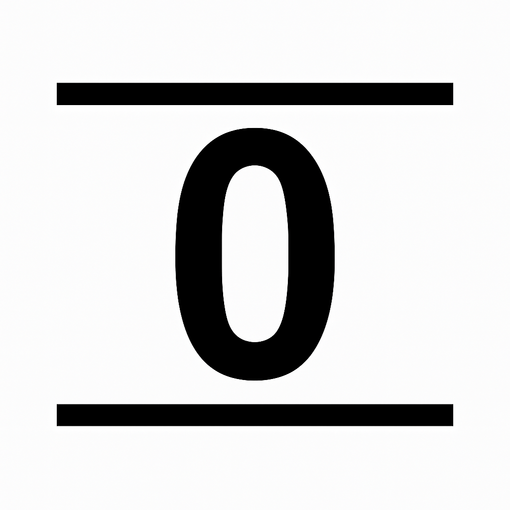
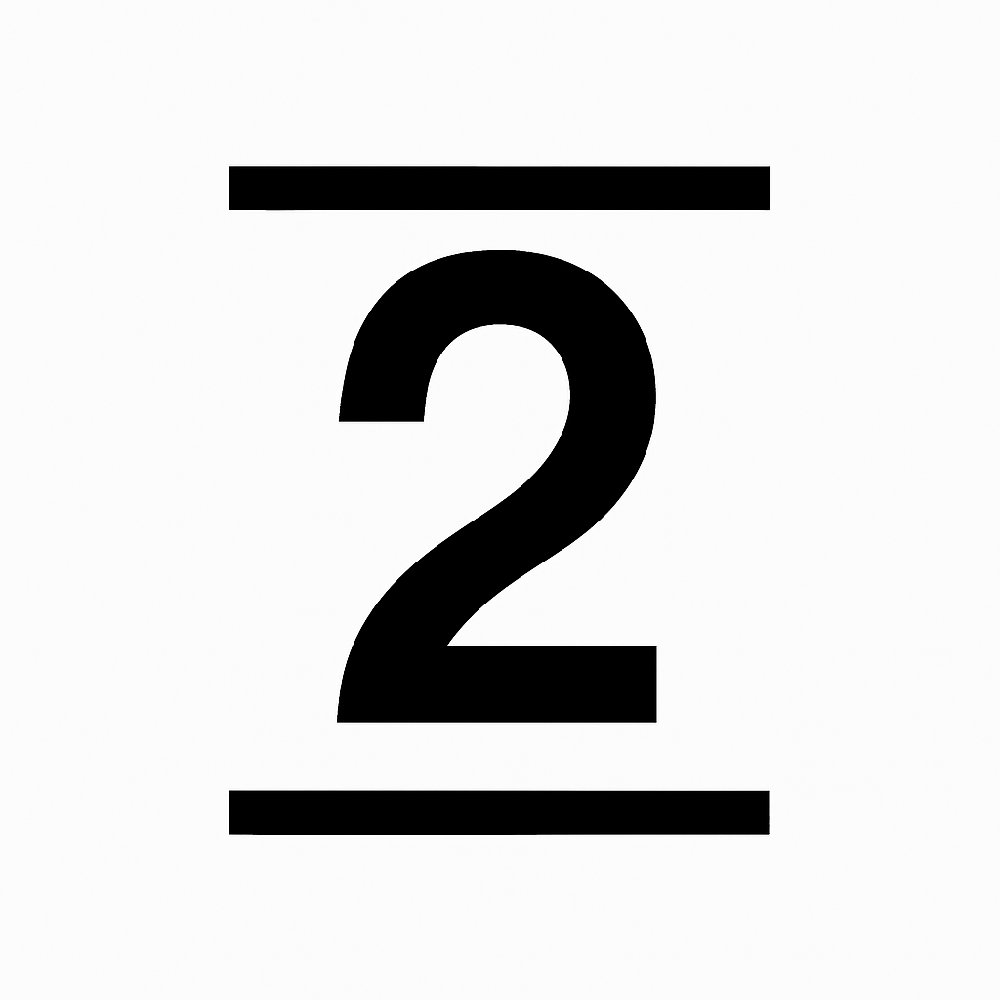
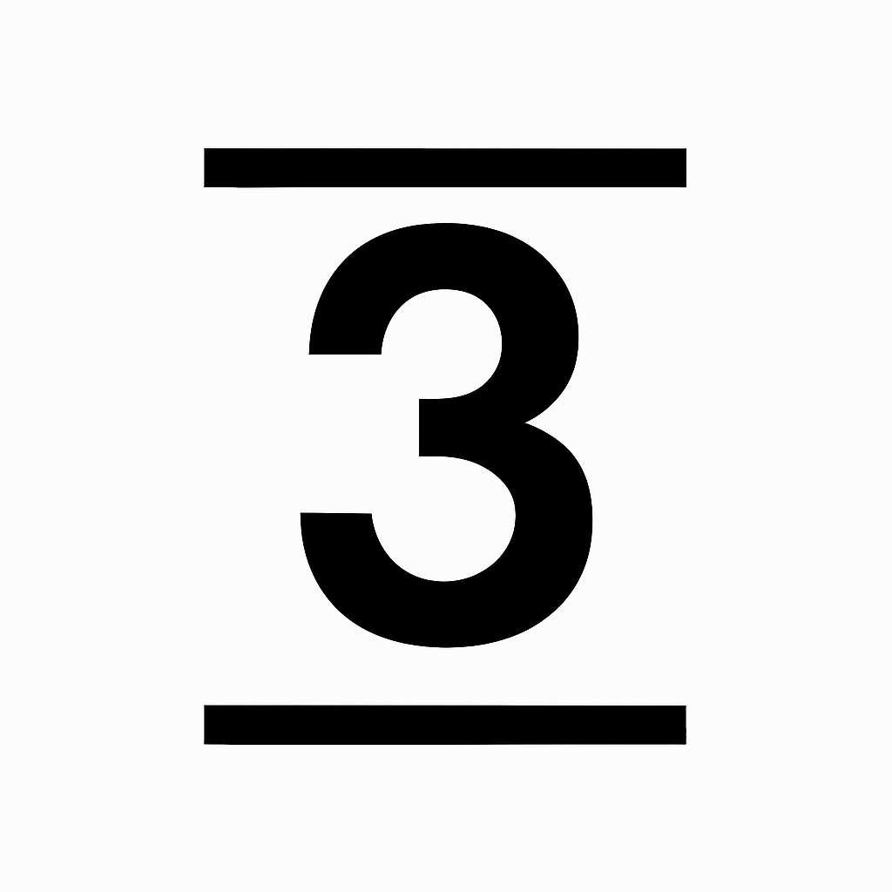
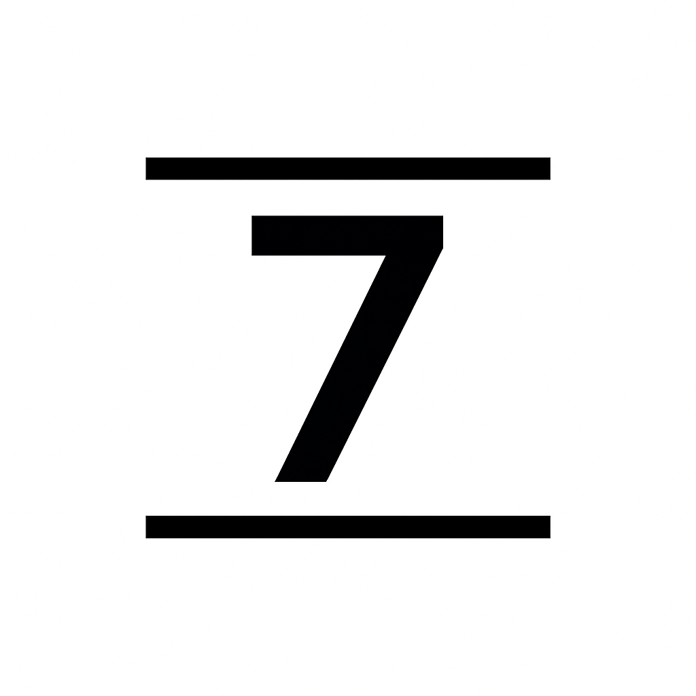
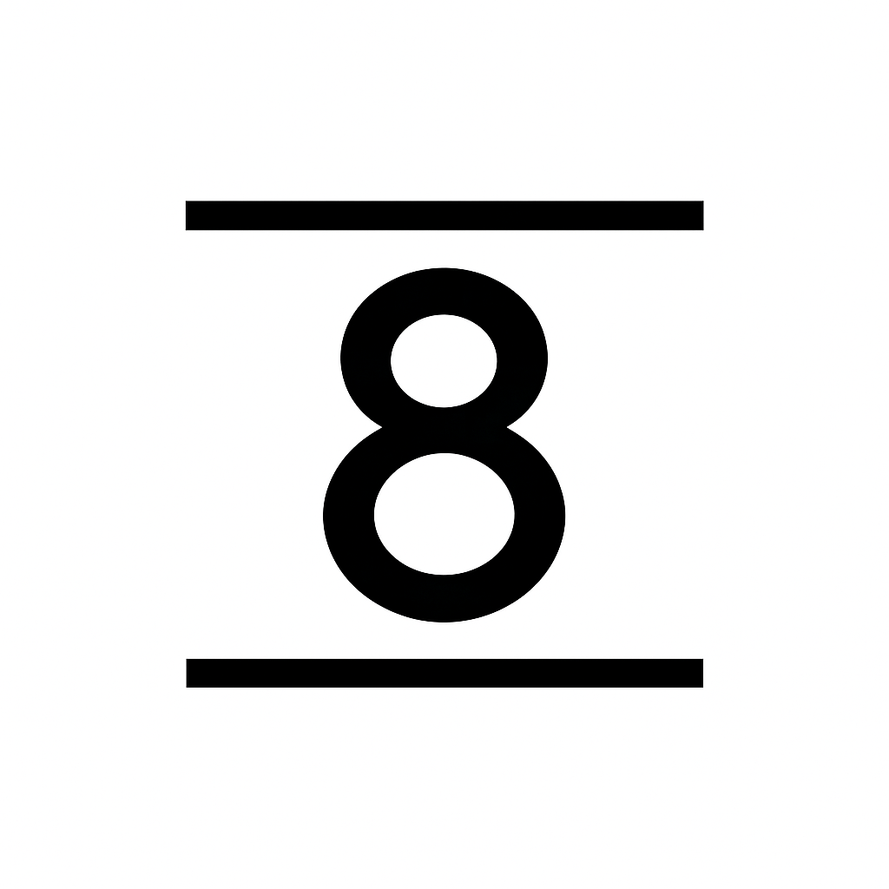
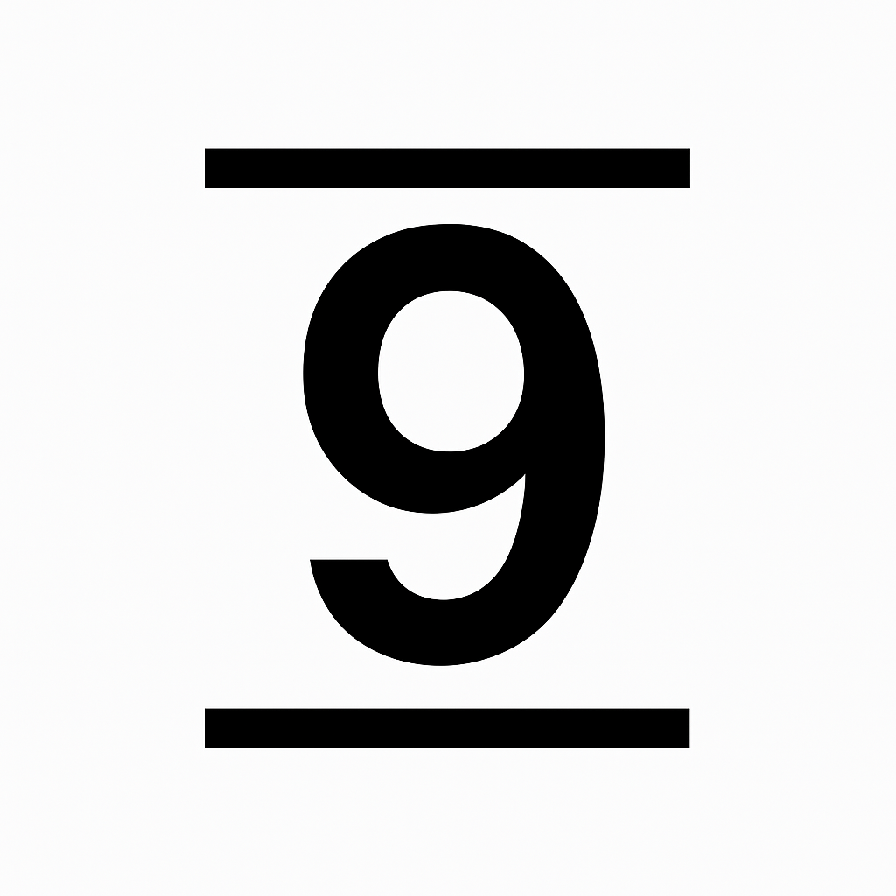

# nanpa-linja-n — A Complete Numeric System for Toki Pona

## Overview
nanpa-linja-n is a fully structured numeric system designed to integrate seamlessly with Toki Pona phonology, grammar, and semantics while providing a full-featured representation of numbers including integers, decimals, fractions, negatives, and large values.

This system emphasizes:
- digit-block compression
- concatenated number construction
- phonotactically valid roots
- compatibility with the Toki Pona lexicon


Toki Pona’s vocabulary is small, but not too small.
It’s big enough to be functional while still keeping the language simple.
This number system aims to follow that same idea: staying as simple as possible while still being practical for everyday use.
It’s not meant to replace anything—just to offer a tool that fits naturally into the language’s minimal design.


## Digit Words (0–9)
Each digit uses a distinct, single syllable, CVN form and does not conflict with any Toki Pona words:

```
0  non
1  wan
2  tun
3  ton
4  pon
5  lun
6  jun
7  pen
8  win
9  nen

10 = ten (if used by itself or wanon for digit-emphasis)
```

---

## Internal Digit-Block Rule
Inside a digit block (no separator present):

**Concatenate digit names and drop the final -n from every digit name except the last.**


### Examples

- 10 → wan non → **wanon**
- 46 → pon jun → **pojun**
- 70 → pen non → **penon**
- 100 → wan non non → **wanonon**
- 567 → lun jun pen → **lujupen**
- 234 → tun ton pon → **tutopon**
- 801 → win non wan → **winowan**
- 950 → nen lun non → **nelunon**


---

## Large Number Units

### Standard Units
Used when non-zero digits follow the block:

```
tasa = thousand
masa = million
wasa = billion
```

### Zero-Block Units  
Used only when *everything after* the block is zero:

```
tasan = exactly X thousand
masan = exactly X million
wasan = exactly X billion
```


### Any number of blocks
Used for any number of blocks, these separators have no specific values:

```
pasa  = more than one part of number to follow
pasan = last part of number follows
```


### Examples
```
1,234       → wan tasa tutopon
12,000      → watun tasan
3,000,000   → ton masan
30,000,000  → tonon masan
300,000,000 → tononon masan
3,000,000,000 → ton wasan
7,321,900   → pen masa totuwan tasa nenonon
123456789   → watutopolujupewinen (using block words is optional, but often very helpful for understanding)
123456789   → watun pasa topolun pasan jupewinen (pasa and pasan can be used anywhere to break up large numbers)
123456789   → watutopolun pasan jupewinen
123456789   → watuton pasa polun pasa jupewin pasan nen
2025        → tunotulun
2025        → tun tasa tulun
2025        → tunon pasan tulun
2025        → tun pasa non pasa tun pasan lun
3.141592    → ton pokala wapowalunetun
```

---

## Decimal Separator — pokala
**pokala** separates whole and decimal parts.

Rules:

- Whole part ends in full -n form
- Decimal block follows the digit-block rule

Examples:

```
0.5    → non pokala lun
3.75   → ton pokala pelun
12.04  → watun pokala nopon
37.9   → topen pokala nen
0.125  → non pokala watulun
```

---

## Fractions — kipisi
**kipisi** expresses fractions “over / divided by”.

Rule:

- Both numerator and denominator use full final -n
- Internal block compression applies

Examples:

```
1/2                 → wan kipisi tun
3/4                 → ton kipisi pon
5/8                 → lun kipisi win
567/890             → lujupen kipisi winenon
1,234 / 56          → wan tasa tutopon kipisi lujun
3 / 1,000,000,000   → ton kipisi wan wasan
```

---

## Negative Numbers — ike
Prefix **ike** before any number:

```
−5         → ike lun
−12        → ike watun
−0.4       → ike non pokala pon
−30,000    → ike tonon tasan
```

---

## Mixed Expressions

```
(3.75) / 4   → ton pokala pelun kipisi pon
3 / 4.75     → ton kipisi pon pokala pelun
1,234.567    → wan tasa tutopon pokala lujupen
0.5          → non pokala lun
1/2          → wan kipisi tun
5:38         → tenpo lun pokala towin
19:46:27     → tenpo wanen pokala pojun pokala tupen
```

---

## Design Rationale

### Digit Roots
- Unique initials
- Easy to remember
- End in **-n** for structural consistency, for long digit sequences the end is clearly signaled
- No conflict with Toki Pona vocabulary
- Where possible, respects the first syllable of existing Toki Pona digit names
- Uses a decimal (base-10) structure because this is the system most people encounter every day
- Can still use ala, wan, tu, luka, mute, ale, if these words describe the whole numeric value
- Designed to complement ala, wan, tu, luka, if the whole numeric value needs any more words to fully describe (for example: lun masan, wan kipisi tun, wanon)
- Can be used as a drop-in replacement for digits in dates, times, phone numbers, codes, and any context where precise numeric information is needed
- Very useful when speaking and hearing the digits of long values ( 5201 → lutunowan )
- (Can be easily parsed with lex/yacc)

### pokala
- Contains **k**, which no digit word has
- Ends in **-la** (safe from digit collision)
- Meaning evokes “next section/context” (poka la)
- Clean separator word
- Can be used with tenpo for hour and minute delimiter

### kipisi
- Contains **s**, which no digit word has
- Meaning evokes “division”
- Clean separator word
- Can use **kipisi ala** for multiply without getting confused with divide by zero

### tasa / masa / wasa
- Contain **s**, which no digit word has
- Clean separator word

### tasan / masan / wasan
- Contain **s**, which no digit word has
- All end in **-n** to signal end of number description
- Zero-block shortcuts for clear large numbers
- Clean separator word

### pasa / pasan
- Contain **s**, which no digit word has
- Meaning evokes “to pass over”
- A bridge joining different parts of the whole numeric value
- pasan ends in **-n** to signal that the last part of the number follows
- Clean separator word

### sitelen pona (only suggestions)
- Could pragmatically use arabic numerals as numeric glyphs with a horizontal straight line at top and bottom of each glyph
- This alligns glyphs for numbers with the rectangular box used for proper names
- So might have this glyph for 42,386.75 (numeric glyphs starting with nanpa surrounded in a rectangular box like a proper name and re-purposing poki and meso glyphs):
- 
- Glyphs for numerals should be distinct and not rely on observing subtle changes in the glyphs.
- Examples:
- &nbsp;&nbsp;&nbsp;&nbsp;&nbsp;&nbsp;&nbsp;&nbsp;&nbsp;&nbsp;
- &nbsp;&nbsp;&nbsp;&nbsp;&nbsp;&nbsp;&nbsp;&nbsp;&nbsp;&nbsp;
- The straight lines at the top and bottom of each glyph could be replaced with vertical lines at the left and right of each glyph to stack them vertically.


---

## License
This project is licensed under the Creative Commons Attribution 4.0 International License (CC BY 4.0).

See the LICENSE file for details.

---

## Exercises
Have someone read the nanpa-linja-n sentences in the [examples](examples.md), and check how many of them you can correctly understand.

This demonstrates the motivation behind this number system.

---

## Community & Contributions
Discussion welcome via:

- ma pona pi toki pona Discord

- https://sona.pona.la/wiki/User:JanMatun

Pull requests, corrections, and refinements are encouraged.
