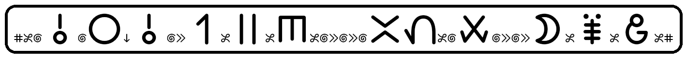
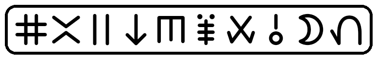
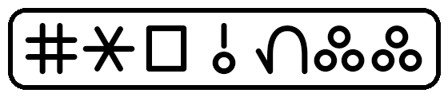
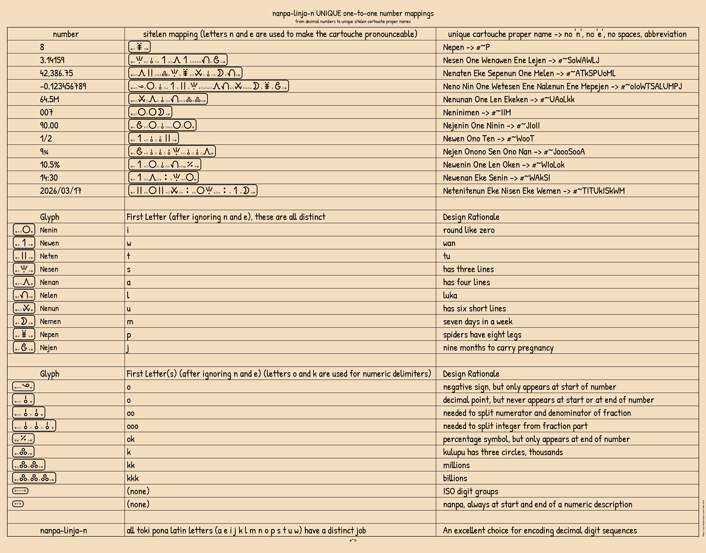
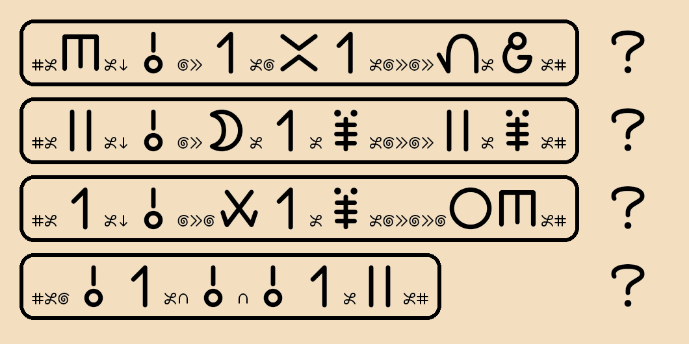
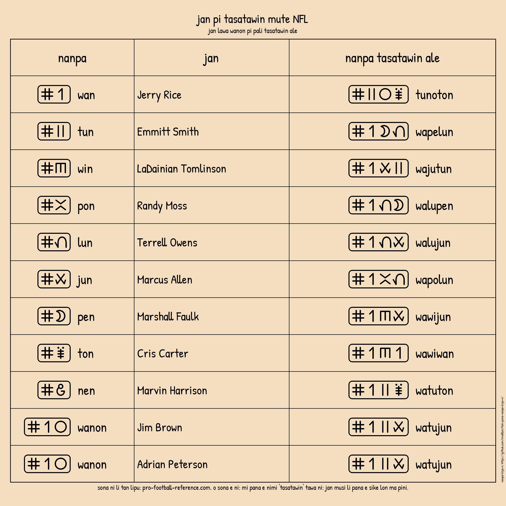

# nanpa-linja-n — A Simple, Easy Way to Communicate a String of Decimal Digits in Toki Pona

o weka e nimi ike.

## TL;DR:

**nanpa-linja-n** motivation:


### Saying the number "23,645":

| Language                 | Spoken number phrase                                 | Feels                     |
|--------------------------|------------------------------------------------------|---------------------------|
| English                  | twenty three thousand six hundred (and) forty five   | natural                   |
| French                   | vingt trois mille six cent quarante cinq             | natural                   |
| Esperanto                | dudek tri mil sescent kvardek kvin                   | natural                   |
| Lojban                   | (li) re ci xa vo mu (boi)                            | functional, sterile       |
| Toki Pona (pu)           | mute                                                 | useless                   |
| Toki Pona (nanpa pona)   | tu ale mute luka luka luka wan ale mute mute luka    | contrived, error prone    |
| Toki Pona (nanpa-linja-n)| **tuwin tasa jupolun**                               | natural                   |


## Overview
**nanpa-linja-n** is a fully structured system designed to integrate seamlessly with Toki Pona phonology, grammar, and semantics while providing a full-featured representation of strings of digits including integers, decimals, fractions, negatives, large values and IDs.

This system emphasizes:
- digit-block compression
- concatenated digit construction
- phonotactically valid roots
- compatibility with the Toki Pona lexicon
- consistently using **-n** as a morphological marker at the end of digit sequences


Toki Pona’s vocabulary is small, but not too small.
It’s big enough to be functional while still keeping the language simple.
This system aims to follow that same idea: staying as simple as possible while still being practical for everyday use.
It’s not meant to replace anything—just to offer a tool that fits naturally into the language’s minimal design.


## Digit Symbol Words (0–9)
Each digit symbol uses a distinct, single syllable, CVN form and does not conflict with any Toki Pona words:

```
"0"  non
"1"  wan
"2"  tun
"3"  win
"4"  pon
"5"  lun
"6"  jun
"7"  pen
"8"  ton
"9"  nen
```

---

## Internal Digit-Block Rule
Inside a digit block (no separator present):

**Concatenate digit names and drop the final -n from every digit name except the last.**


### Examples

- 10 → wan non → **wanon**
- 46 → pon jun → **pojun**
- 70 → pen non → **penon**
- 100 → wan non non → **wanonon**
- 567 → lun jun pen → **lujupen**
- 234 → tun win pon → **tuwipon**
- 801 → ton non wan → **tonowan**
- 950 → nen lun non → **nelunon**


---

## Large Number Units

### Standard Units
Used when non-zero digits follow the block.

Adds more context, makes the assumption that the string of digits represents a numeric value:

```
tasa = thousand
masa = million
wasa = billion
```

### Zero-Block Units  
Used only when *everything after* the block is zero.

Adds more context, makes the assumption that the string of digits represents a numeric value:

```
tasan = exactly X thousand
masan = exactly X million
wasan = exactly X billion
```


### Any number of blocks
Used for any number of blocks, these separators have no specific values.

Does not add more context, makes no assumption that the string of digits represents a numeric value:

```
pasa  = more than one part of digit sequence to follow
pasan = last part of digit sequence follows
```


### Examples
```
1           → wan
08          → noton
23          → tuwin
679         → jupenen
1,234       → wan tasa tuwipon
12,000      → watun tasan
12000       → watun pasan nononon
3,000,000   → win masan
30,000,000  → winon masan
300,000,000 → winonon masan
3,000,000,000 → win wasan
7,321,900   → pen masa wituwan tasa nenonon
64.5M       → jupon oselo lun masan
64.5B       → jupon oselo lun wasan
64.5T       → jupon oselo lun tasa wasan
123456789   → watuwipolujupetonen (using block words is optional, but often very helpful for understanding)
123456789   → watun pasa wipolun pasan jupetonen (pasa and pasan can be used anywhere to break up large numbers)
123456789   → watuwipolun pasan jupetonen
123456789   → watuwin pasa polun pasa jupeton pasan nen
2025        → tunotulun
2025        → tun tasa tulun
2025        → tunon pasan tulun
2025        → tun pasa non pasa tun pasan lun
3.141592    → win oselo wapowalunetun
```

---

## Decimal Separator — oselo
**oselo** separates whole and decimal parts.

Rules:

- Whole part ends in full -n form
- Decimal block only uses pasa/pasan to break up long digit sequences
- Adds more context, makes the assumption that the strings of digits represent numeric values

Examples:

```
0.5       → non oselo lun
3.75      → win oselo pelun
12.04     → watun oselo nopon
37.9      → wipen oselo nen
0.125     → non oselo watulun
3.141592  → win oselo wapowan pasan lunetun
```

---

## Fractions — esewi
**esewi** expresses fractions “over / divided by”.

Rule:

- Both numerator and denominator use full final -n
- Adds more context, makes the assumption that the strings of digits represent numeric values

Examples:

```
1/2                 → wan esewi tun
3/4                 → win esewi pon
5/8                 → lun esewi ton
9¾                  → nen okin win esewi pon
9¾                  → winen esewi pon
567/890             → lujupen esewi tonenon
1,234 / 56          → wan tasa tuwipon esewi lujun
3 / 1,000,000,000   → win esewi wan wasan
```

---

## Negative Numbers — nike
Prefix **nike** before any number:

- Adds more context, makes the assumption that the string of digits represents a numeric value

```
−5         → nike lun
−12        → nike watun
−0.4       → nike non oselo pon
−30,000    → nike winon tasan
```

---

## Mixed Expressions

```
(3.75) / 4   → win oselo pelun esewi pon
3 / 4.75     → win esewi pon oselo pelun
1,234.567    → wan tasa tuwipon oselo lujupen
0.5          → non oselo lun
1/2          → wan esewi tun
5:38         → tenpo lun oselo witon
19:46:27     → tenpo wanen oselo pojun oselo tupen
```

---

## Design Rationale

### Digit Roots
- Unique syllables
- Easy to remember and use
- Very useful when speaking and hearing long sequences of digits ( 5201 → lutunowan → 5201 )
- End in **-n** for structural consistency, for long digit sequences the end is clearly signaled
  - This works with the Toki Pona language syntax to enhance communication
    - Say "2010": "tun tasa wanon"
    - Say "2000" followed by "10": "tun tasan wanon"
    - Say "2001" followed by "0": "tun tasa wan non"
    - Say "2001.0": "tun tasa wan oselo non"
    - Say "243-555-0169": "tupowin pasa lululun pasan nowajunen"
    - The **-n** is a morphological marker, indicating the end of a digit sequence
    - Screen readers can communicate longer digit sequences with less cognitive load
    - Automated text-to-speech systems can communicate longer digit sequences with less cognitive load
    - Can enhance compatability with [WCAG 2.2](WCAG%202.2%20compliance%20claims.md)
  - The speaker wants to communicate **"1 2 3 4 5"**:
    - for counting,
      - might say: **"wan tun win pon lun"**
    - for value 12,345,
      - might say: **"watun tasa wipolun"**
      - saying "tasa" adds the context that the strings of digits represent numbers
    - for sequence of digits, like an id,
      - might say: **"watuwipolun"**
    - for 1-2-3-4-5 digit emphasis,
      - might say: **"wan pasa tun pasa win pasa pon pasan lun"**
    - for breaking up long sequences with no change in value, (pasa/pasan can be used anywhere)
      - might say: **"watuwin pasan polun"**
    - In all cases the listener has understood the speaker as communicating **"12345"**
- No conflict with Toki Pona vocabulary
- Where possible, respects the first syllable of existing Toki Pona digit names (from pu)
- Avoids using **k**, **m** and **s** in digit names to reduce overlap with delimiters (and other words)
- By avoiding using **k**, **m** and **s**, words are more easily identified as **nanpa-linja-n** digit strings ( petuton → 723 )
- Respects the speaker’s freedom to choose how to express numbers:
  - Additive (**pu** style) numerals:
    - The speaker uses **pu** names ala, wan, tu, luka, mute, ale
    - The speaker thinks: 78 = 20 add 20 and 20 and 5 and 5 and 5 and 2 and 1
    - The speaker says (the way they think): mute mute mute luka luka luka tu wan
    - The listener recognises **pu** semantics
    - The listener understands: 78
  - Positional decimal (**nanpa-linja-n** style) strings:
    - The speaker uses **nanpa-linja-n** digit names with concatenation and **-n** signalling the end of the string of digits
    - The speaker thinks: 78 = 7 followed by 8
    - The speaker says (the way they think): peton
    - The listener recognises **nanpa-linja-n** semantics (since no word collision and syntax is consistent)
    - The listener understands: "78"
    - The listener may understand that "78" represents a numeric value, but that understanding is determined by context
  - Any system that groups digits before speaking adds cognitive load for the speaker, because they must pre-determine consistent groupings before saying anything.  **nanpa-linja-n** works with the ISO conventional digit separators using tasa/tasan
  - By contrast, speaking one digit at a time lets the speaker break long sequences anywhere without losing meaning.  **nanpa-linja-n** can break large strings of digits up using pasa/pasan, without assuming that the string of digits represents a numeric value
- Can be used as a drop-in replacement for (base 10) digits in dates, times, phone numbers, codes, and any context where precise digit information is needed
- (Can be easily parsed with lex/yacc)
- (Yet another humble attempt at simply being functional, avoiding copy and paste and cognitive load)


### oselo
- Contain **s**, which no digit word has
- Do not end in **-n** signalling more of the number to follow
- Meaning derived from “selo”
- Can be used with tenpo for hour and minute delimiter
- Adds more context, makes the assumption that the strings of digits represent numeric values

### esewi
- Contains **s**, which no digit word has
- Does not end in **-n** signalling more of the number to follow
- Meaning derived from "sewi"
- Adds more context, makes the assumption that the strings of digits represent numeric values

### nike
- Contains **k**, which no digit word has
- Does not end in **-n** signalling more of the number to follow
- Meaning derived from "ike"
- Always occurs at the start of a numeric expression (after nanpa)
- Adds more context, makes the assumption that the string of digits represents a numeric value

### tasa / masa / wasa
- Contain **s**, which no digit word has
- Does not end in **-n** signalling more of the number to follow
- Adds more context, makes the assumption that the strings of digits represent numeric values

### tasan / masan / wasan
- Contain **s**, which no digit word has
- All end in **-n** to signal end of number description
- Zero-block shortcuts for clear large numbers
- Adds more context, makes the assumption that the string of digits represents a numeric value
- can repeat any number of times to express more 000 groupings at the end of numbers (e.g. masan wasan wasan)

### pasa / pasan
- Contain **s**, which no digit word has
- Meaning inspired by pana but with an **s**
- A bridge joining different parts of the whole string of digits
- pasa does not end in **-n** signalling more of the string of digits to follow
- pasan ends in **-n** to signal that the last part of the string of digits follows
- Have no value, only used to break up long sequences of digits
- Never occurs at the start of a numeric expression or after a decimal point
- Does not add more context, makes no assumption that the string of digits represents a numeric value

### sitelen pona
- **nanpa-linja-n** numeric glyphs are always presented inside a cartouche and always starting with the nanpa glyph
- the nanpa glyph will never be found anywhere else except at the start of a nanpa-linja-n number
- there is a **UNIQUE** one-to-one mapping from numbers to cartouche "labels"
  - all the digits and separators are mapped to separate letters (see tables below)
  - when a cartouche starts with a nanpa glyph and all the glyphs in the cartouche belong to the set below, then we interpret the cartouche as a nanpa-linja-n number
  - when writing down the word from the cartouche, we will write it out as all capitals, so we can easily see that it encodes a number
    - a nanpa-linja-n literal string of **NNIOWTSNALUNMPJ**, can be decoded as **-0.123456789** (with the pasa/pasan removed)
      - 
    - a nanpa-linja-n literal string of **NJOOSEA**, can be decoded as **9¾**
      - 
    - a nanpa-linja-n literal string of **NATNSPUOML**, can be decoded as **42,386.75**
      - 
    - a nanpa-linja-n literal string of **NUAOLKK**, can be decoded as **64.5M**
      - 
- can be displayed horizontally or vertically
- We will reuse existing glyphs (and think of them as having extra names in the context of **nanpa-linja-n** cartouches), all letters will be written out in capitals:
  - there already exist glyphs in pu that have more than one name (we are just adding extra names to more existing glyphs to map to this decimal system)
  - the brackets in these examples are just to depict the cartouche (and not written down):
  - 17 → (NWM) → wapen
  - 2,860 → (NTNPUI) → tun tasa tojunon
  - 3.14159 → (NSOWAWNLJ) → win oselo wapowan pasan lunen
  - the number 3 → (NS) → win
  - the third → nanpa (written outside of cartouche) (NS) → nanpa win

| Glyph                                                             | Letter       | #~n Name  | Design Rationale               |
|-------------------------------------------------------------------|--------------|-----------|--------------------------------|
|        | I            | non       | round like zero                |
|        | W            | wan       | wan                            |
|     | T            | tun       | tu                             |
|     | S            | win       | looks like 3 on its side       |
|     | A            | pon       | has four lines towards center  |
|        | L            | lun       | luka                           |
|     | U            | jun       | has six short lines            |
|     | M            | pen       | seven days in week             |
|     | P            | ton       | spiders have eight legs        |
|     | J            | nen       | nine months to carry pregnancy |


- the table below has some other delimiters used in numeric expressions inside cartouches:
- the table has some duplicate letters, but the letter placements will determine how the letter is interpreted:
  - N is duplicated
    - N at start is always nanpa, this is the only place that nanpa will be found
    - N after N (depicted with ni) represents nike, negative
    - N after O (depicted with ni) represents nike, negative
    - N after anything else (depicted with ni) represents tasa/masa/wasa/pasa/pasan
  - K is duplicated
    - K can repeat but that maps to repeated kulupu representing tasan, masan, wasan
    - K can be repeated many times to show any number of 000 groups at the end of a number
  - O is duplicated
    - O by itself represents oselo, the decimal point
    - O doubled represents okin, the delimiter between integer part and fraction part of a number (when integers have additional fraction parts)

| Glyph                                                                                          | Letter(s)    |  #~n Name                 | Design Rationale                                      |
|------------------------------------------------------------------------------------------------|--------------|---------------------------|-------------------------------------------------------|
|                  | O            | oselo                     | decimal point, has small circle at the bottom         |
|       | OO           | okin                       | needed to split integer from fraction part            |
|                 | E            | esewi                     | needed to split numerator and denominator of fraction |
|                                 | K            | tasan                     | kulupu has three circles, thousands                   |
|                                 | KK           | masan                     | millions                                              |
|                                 | KKK          | wasan                     | billions                                              |
|                | N            | tasa/masa/wasa/pasa/pasan | natural break                                         |
|                           | N            | nike                      | downwards suggests negative                           |
|                         | N            | nanpa                     | nanpa, always at start of numeric description         |


Sitelen Glyph Summary:




---

## Arithmetic Operations
Here we are moving away from describing numbers to describing simple arithmetic expressions.
This is not the main focus of this proposal.
Some of the suggestions below are inspired by [seximal] nasin nanpa suli, tan jan Emalan

### Equals: sama
- Contains **s**, which no digit word has
- Good candidate
- Never appears in a numeric cartouche

### Addition: okin
- Contains **k**, which no digit word has
- Meaning inspired by "kin"
- Good candidate
- Adds more context, makes the assumption that the strings of digits represent numeric values
- Never appears in a numeric cartouche (but integer and fraction separator can appear in a numeric cartouche)
- win okin tun okin wan li sama jun

### Subtract: weka
- Contains **k**, which no digit word has
- Meaning invokes "away"
- Good candidate
- Adds more context, makes the assumption that the strings of digits represent numeric values
- Never appears in a numeric cartouche (but negative symbol can appear in a numeric cartouche)
- win weka nike tun li sama lun

### Multiply: emute
- Contains **m**, which no digit word has
- Meaning inspired by **en** + **mute** (add many)
- Good candidate
- Adds more context, makes the assumption that the strings of digits represent numeric values
- Never appears in a numeric cartouche
- win emute tun li sama jun

### Division: kipisi
- Contains **k**, which no digit word has
- Good candidate
- Adds more context, makes the assumption that the strings of digits represent numeric values
- Never appears in a numeric cartouche (but fraction symbol can appear in a numeric cartouche)
- ton kipisi nike tun li sama nike pon

### Power: sewi
- Contains **s**, which no digit word has
- Good candidate
- Adds more context, makes the assumption that the strings of digits represent numeric values
- Never appears in a numeric cartouche
- tun sewi win li sama ton
- pen tasan li sama pen emute wanon sewi win

Other mathematical expressions like log, ln, exp, roots, cos, pi (and maybe even powers) are better left in mathematical notation:

cos(2π) = 1

√9 = 3

and have the community calque what are useful ways to describe these expressions


---

## License
This project is licensed under the Creative Commons Attribution 4.0 International License (CC BY 4.0).

See the LICENSE file for details.

---

## Exercises
Have someone read the nanpa-linja-n sentences in the [examples](examples.md), and check how many of them you can correctly understand.

This demonstrates the motivation behind this number system.

Use other Toki Pona number systems, that you know, to expresss the sentences in the [examples](examples.md) and compare with **nanpa-linja-n** for ease of listening effort and understanding.  When seeing a (decimal) number for the first time, how much mental effort does the speaker have to exert in order to determine what the numeric description will be?  Do the number descriptions make the sentence harder to understand?  This feedback would be appreciated.

Use the [nanpa_linja_n_anki_examples.csv](nanpa_linja_n_anki_examples.csv) to build an Anki deck.

---

## Community & Contributions
Discussion welcome via:

- The 'Discussions' tab on this Github repository

- https://sona.pona.la/wiki/nasin_nanpa_linja_n (you need an account on sona pona to view this page)

- Comments on tokipona channel on Reddit (mention nanpa-linja-n in your posts, so its clear what subject your post is about)

- kama sano Discord: https://discord.com/channels/969386329513295872/1442150091816440000

- On [https://sona.pona.la/wiki/nasin_nanpa_ali_ike](https://sona.pona.la/wiki/nasin_nanpa_ali_ike#[decimal]_nanpa-linja-n) list, **nanpa-linja-n** looks most closest to (at first glance):

  - [decimal] socks numeral (based on cantonese), tan socks

  - [decimal] [humorous] kijetesantakalu polinpin, tan jan Kita (shameless self-promotion)

  - [decimal] nasin nanpa nimi, tan kijetesantakalu Iwan

  - [decimal] lojban, tan jan Tepo

  - Esperanto and Lojban

  - how **nanpa-linja-n** compares to these (at first glance):

    - it describes a string of digits, the context will determine if the string of digits represents a numeric value

    - it uses the first syllable of the pu words for digits for better compatability (where possible), reducing cognative load

    - it uses less letters to describe digits, this leaves more letters for delimiters and also there is less chance of clashing with other vocabulary, so words can be immediately identified as describing sequences of digits

    - it uses **-n** at the end of the base name for the digits (CVN format), so that single digit names are consistent with the descriptions of other digit strings

    - it consistently uses **-n** to indicate the end of digit strings

    - it consistently uses **-n** to indicate the end of numerical structures that end with delimiters (tasan/masan/wasan)

    - the consistent use of **-n** as a morphological marker is original

    - the consistent use of **-n** makes it immediately clear when a string of digits stops, no matter how long the sequence of digits. The listener spends little mental effort deciding whether the digit sequence is complete, and context will determine if the digit sequence represents a numeric value

    - while using similar principles, it provides a more consistent way to express numbers — including large ones — reducing learning effort and cognitive load on both speaker and listener

---

## Bigger Picture

**nanpa-linja-n** can be considered part of a bigger Unicode project described here: [Unicode Discussion](toki%20pona%20bigger%20unicode%20picture.md)


---


## Paying the lexical price: indexed families with nanpa-linja-n

If we accept the cost of adding the **nanpa-linja-n** digit roots to the language, we can use them for more than just the great advantage of reading raw digits. They give us a clean, reusable structure for talking about **indices in ordered families**:

> **`[FAMILY] sike nanpa [nanpa-linja-n]` = the N-th member of that family**

- `[FAMILY] sike` names some ordered cycle or sequence (weekdays, months, levels, modes, etc.).
- `nanpa` marks that what follows is an index.
- `[nanpa-linja-n]` is a digit or digit-string name (with compression) that corresponds exactly to the written index.


This pattern lets us talk about positions in a family in a way that:

- reuses the same lexical machinery across many domains
- avoids inventing separate lexical items like “Sunday”, “March”, “Level 05” in every case
- zero based indexing (where appropriate) is possible and naturally addressed with **non**
- can also easily reference expressions that start with zero: 'musi utala sike nanpa nolun'
- sike nanpa (cycle number) usage is not the same as tenpo X nanpa Y
  - relative index: tenpo suno nanpa wan → the first day
  - absolute index: (tenpo) suno sike nanpa wan → Monday

Below are two practical examples.

---

### Example 1: Weekdays (`suno sike`, Monday = 1, ISO Standard)

Define the ordered family of weekdays as:

- `suno sike` = “cycle of suns” → the weekly cycle.

We choose a **Monday-first, 1-based** convention:

> `suno sike nanpa X` = weekday with index X in this cycle
> `wan = Monday, tun = Tuesday, …, pen = Sunday`

Using nanpa-linja-n digit names:

- suno sike nanpa **wan** = weekday 1 = Monday
- suno sike nanpa **tun** = weekday 2 = Tuesday
- suno sike nanpa **win** = weekday 3 = Wednesday
- suno sike nanpa **pon** = weekday 4 = Thursday
- suno sike nanpa **lun** = weekday 5 = Friday
- suno sike nanpa **jun** = weekday 6 = Saturday
- suno sike nanpa **pen** = weekday 7 = Sunday


Usage:

```
suno sike nanpa pen la mi awen tomo.
= On weekday 7 (Sunday) I stay home.

suno sike nanpa tun la mi pali.
= On weekday 2 (Tuesday) I work.

suno sike nanpa lun la mi tawa utala.
= On weekday 5 (Friday) I go to sport.
```


### Example 2: Months of the year (mun sike)
Define the ordered family of months as:

- `mun sike` = “cycle of moons” → the 12 Gregorian months.

We use a 1-based convention:

- mun sike nanpa X = month with index X in the year (1 = January … 12 = December)

Using digit name compression for multi-digit indices:

- mun sike nanpa **wan** = month 1 = January

- mun sike nanpa **tun** = month 2 = February

- mun sike nanpa **win** = month 3 = March

- mun sike nanpa **pon** = month 4 = April

- mun sike nanpa **lun** = month 5 = May

- mun sike nanpa **jun** = month 6 = June

- mun sike nanpa **pen** = month 7 = July

- mun sike nanpa **ton** = month 8 = August

- mun sike nanpa **nen** = month 9 = September

- mun sike nanpa **wanon** = month 10 = October (compressed wan+non → “10”)

- mun sike nanpa **wawan** = month 11 = November (compressed wan+wan → “11”)

- mun sike nanpa **watun** = month 12 = December (compressed wan+tun → “12”)

Usage:

```
tenpo suno nanpa tu lon mun sike nanpa win la mi tawa.
= On day 2 of month 3 (2 March) I travel.

mi pali mute lon mun sike nanpa wawan.
= I work a lot in month 11 (November).

suno sike nanpa pen lon mun sike nanpa watun la mi kama tomo mama.
= On a Sunday in month 12 (a Sunday in December) I go to my parents' house.
```

### Families that naturally start at zero
Most human-facing families (weekdays, months, school years) are easiest to understand with 1-based indexing, and nanpa-linja-n supports that directly, as shown above.

However, some families naturally start at zero in the outside world:

- programming arrays and lists (item 0, item 1, …),

- test or trial runs (run 0, run 1, …),

- floor systems or counters that label the street level as 0,

- any API or protocol that is explicitly 0-based.

nanpa-linja-n includes a dedicated root for the digit 0:

- non = 0

So the same pattern works immediately for 0-based sequences:

- [FAMILY] sike nanpa **non** = the member at index 0 of that sequence
- [FAMILY] sike nanpa **wan** = the member at index 1 of that sequence, and so on.

Examples:

```
pali alasa sike nanpa non  = test run #0
pali alasa sike nanpa wan  = test run #1

supa tomo sike nanpa non   = floor index 0 (ground floor, in a 0-based system)
supa tomo sike nanpa wan   = floor index 1 (first floor above ground)

ijo sike nanpa non         = element at index 0 in a list/array
ijo sike nanpa tun         = element at index 2
```

The recommendation is:

- Use 1-based indexing for ordinary human concepts (weekdays, months, “Round 2”, etc.).

- Use 0-based indexing only where the external system is already 0-based and that convention is important (code examples, APIs, certain building standards, trial numbers).

Within a given [FAMILY] sike, the choice (0-based or 1-based) should be stated once (or naturally assumed) and kept consistent. nanpa-linja-n’s **non** makes it easy to support 0-based indexing when it is appropriate, without changing the general pattern.

### Why this justifies the lexical cost
Once the digit roots exist, we get a general template:

- suno sike nanpa … → weekdays

- mun sike nanpa … → months

- musi sike nanpa … → game levels

- pali sike nanpa … → steps in a process

- lipu sike nanpa … → pages or slides

- musi utala sike nanpa … → competition rounds

- pali alasa sike nanpa non/wan/tun… → 0- or 1-based test runs

- ijo sike nanpa non/wan/tun… → 0- or 1-based indices in lists/arrays

All reuse the same **[family] sike nanpa [nanpa-linja-n]** structure.

So the argument is:

> If we pay the one-time price of adding **nanpa-linja-n** digit roots to the language, we not only get a precise way to name digit strings, but also gain a uniform, compact pattern for talking about positions in any ordered family (days, months, levels, modes, etc.) that already use numeric labels in the wider world. When those families are 1-based, we can match them directly; and when they are naturally 0-based, we can use **non** to match that convention just as cleanly. We can also put 'non' at the start of any index name (for example: 'musi utala sike nanpa nolun'). The index labels are consistently single-word forms, which makes them predictable to read, say, and parse (all practical index labels are treated the same).


---

## toki musi pona

### musi nanpa

- o pilin e nanpa tan wan kepeken wanon.
- pana e nimi uno tawa nanpa ni.
- o okin e win tan ni.
- o sewi e ni kepeken tun.
- o weka e nen tan ni.
- o kipisi e ni kepeken nanpa nimi uno.
- o weka e nanpa nimi uno tan ni.
- o lukin! nanpa sina li jun.

o lukin sona e nanpa:



### musi sitelen




\#~n


