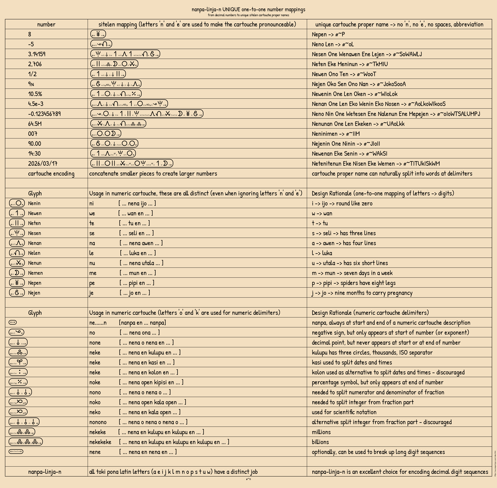
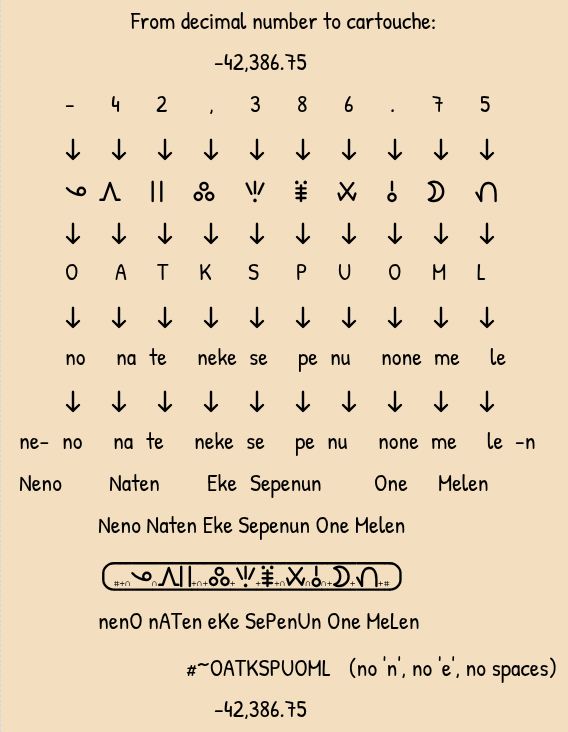
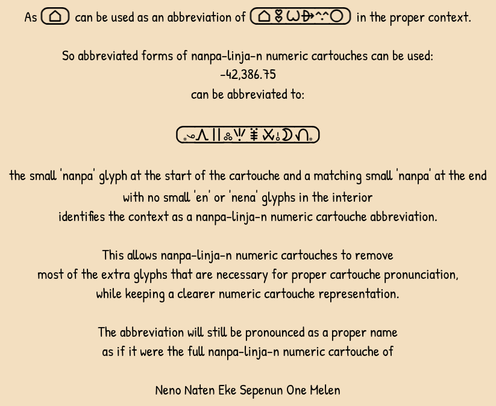
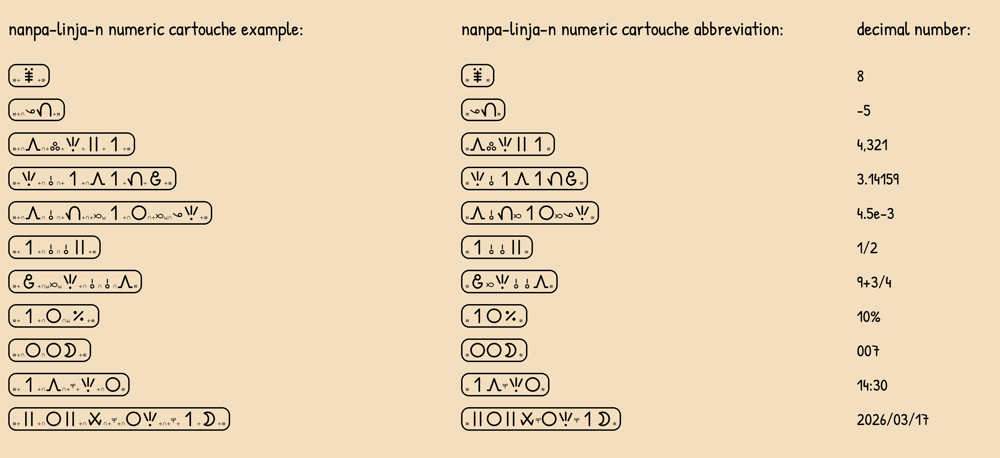
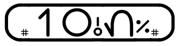
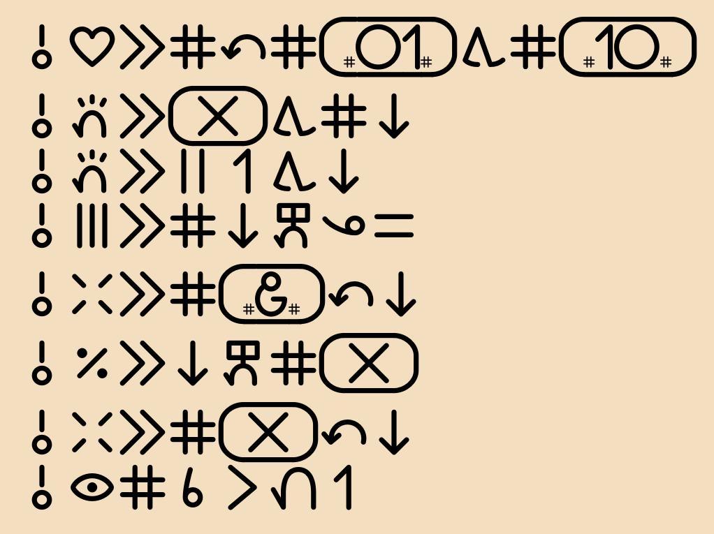
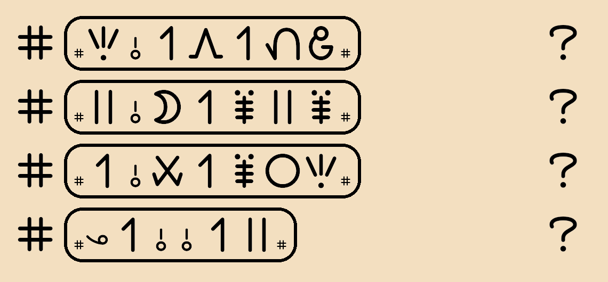
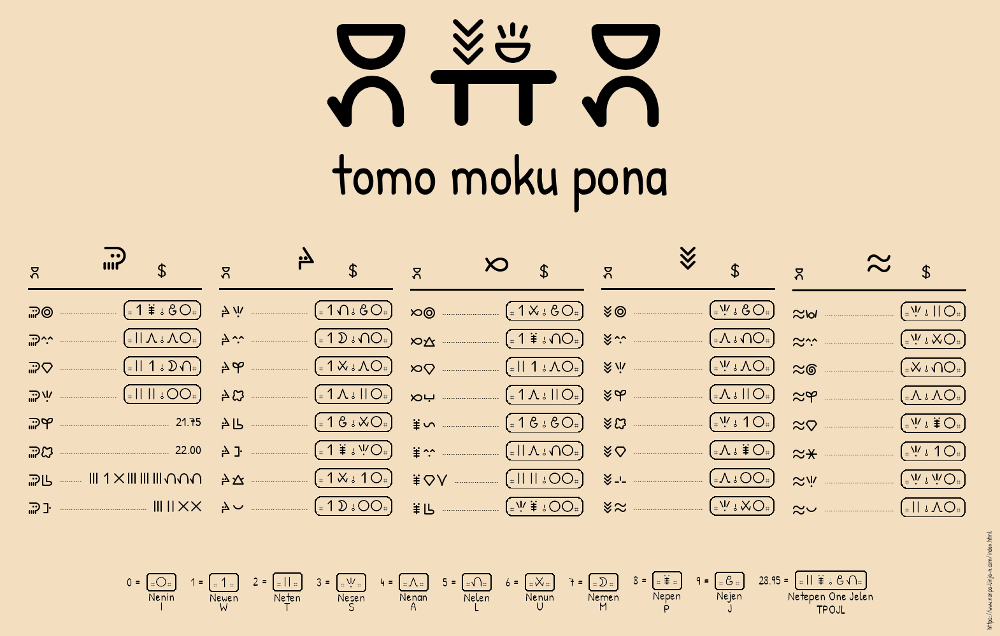

# nanpa-linja-n — A Simple, Easy Way to Communicate a String of Decimal Digits in Toki Pona

o weka e nimi ike.

## TL;DR:

**nanpa-linja-n** motivation:


### Saying the number "23,645":

| Language                 | Spoken number phrase                                 | Feels                     |
|--------------------------|------------------------------------------------------|---------------------------|
| English                  | twenty three thousand six hundred (and) forty five   | natural                   |
| French                   | vingt trois mille six cent quarante cinq             | natural                   |
| Esperanto                | dudek tri mil sescent kvardek kvin                   | natural                   |
| Lojban                   | (li) re ci xa vo mu (boi)                            | functional, sterile       |
| Toki Pona (pu)           | mute                                                 | useless                   |
| Toki Pona (nanpa pona)   | tu ale mute luka luka luka wan ale mute mute luka    | contrived, error prone    |
| Toki Pona (nanpa-linja-n)| **Netesen Eke Nunalen**                              | natural                   |

### Interactive decimal cartouche renderer:

[decimal cartouche renderer](https://mndillon.github.io/toki-pona-nanpa-linja-n/renderer.html)


## Overview
**nanpa-linja-n** in sitelen pona is written using cartouches. The cartouche content is a pure encoding: it defines a unique, reversible mapping from decimal digits (and delimiters such as the decimal point) to designated sitelen pona glyphs and corresponding Latin letters, so the original decimal sequence can be reconstructed exactly.


This does **NOT** introduce any new Toki Pona words or lexicon; it is notation-only. Any “words” discussed below refer only to identifier strings / proper-name labels derived from the cartouche encoding.  When writing down a **nanpa-linja-n** proper name (in Latin script), all words will be capitalized.


The Toki Pona Latin letters i, w, t, s, a, l, u, m, p, j are used to represent the numbers 0, 1, 2, 3, 4, 5, 6, 7, 8, 9 in numeric cartouches.
The letters 'n' and 'e' are used in a nanpa-linja-n cartouche to make the proper name derived from the cartouche more pronouncable.
The letters 'o' and 'k' are used in various combinations to represent numeric punctuation (decimal delimiters).
So all the Toki Pona Latin letters have a distinct job to do in nanpa-linja-n.


Toki Pona’s vocabulary is small, but not too small.
It’s big enough to be functional while still keeping the language simple.
This system aims to follow that same idea: staying as simple as possible while still being practical for everyday use.
It’s not meant to replace anything—just to offer a tool that fits naturally into the language’s minimal design.


---

## sitelen pona nanpa-linja-n cartouches

Sitelen Cartouche Summary:




---

## Unique Numeric Codes:
Every decimal number can be encoded into a unique cartouche (and corresponding abbrevaited cartouche).
The numeric cartouche can be spelled in Latin script as a unique nanpa-linja-n proper name for the number.
The proper name for the number can be used to communicate and reconstruct the original number.
The proper name for the number also gives a unique abbreviation for the number.


This gives us four (or five) uniquely decodable representations of the same underlying number: standard decimal notation, sitelen pona in a cartouche (or abbreviated cartouche), Latin pona proper name, and a unique numeric abbreviation.


Example:

<div style="
  border:1px solid #d0d7de;
  border-radius:6px;
  padding:12px;
  background:#f6f8fa;
  font-family: ui-monospace, SFMono-Regular, Menlo, Monaco, Consolas, 'Liberation Mono', 'Courier New', monospace;
  font-size: 0.95em;
  line-height: 1.6;
">
  -5,432.10 →<br>
  <span style="display:inline-flex; align-items:center; gap:8px; line-height:1;">
    <span style="font-size:1.4em; line-height:1;">#</span>
    
    <span style="line-height:1;">→</span>
  </span><br>
  nanpa Neno Len Eke Naseten One Wenin →<br>
  #~oLkASToWI →<br>
  -5,432.10
</div>


<br/>
<br/>
<br/>


---

## General Number Rule
Applies to all numbers no matter what form they take.

Rules:

- All nanpa-linja-n numeric cartouches will start with nanpa and end with nanpa
- All nanpa-linja-n numeric proper names derived from a cartouche will start with Ne- and end with -n
- Latin nanpa-linja-n numeric proper name: Ne...n
- Numeric Cartouche [nanpa en ... nanpa]
- Abbreviated Cartouche: [nanpa ... nanpa]
- Abbreviation #~: None (There is no 'n' or no 'e' in the nanpa-linja-n abbreviation)
- Abbreviated cartouches are numeric cartouches with the interior words 'nena', 'en' and 'open' removed for clarity of rendering.
- Abbreviated cartouches are pronounced in exactly the same way as the corresponding full numeric cartouche, they only facilitate clearer rendering.
- Notes: A long nanpa-linja-n proper name will usually be split into separate words at numeric punctuation, each separate word will start with a capital letter
- The final -n is always appended to the final nanpa-linja-n proper name word.
- The letters i, w, t, s, a, l, u, m, p, j are used to represent the numbers 0, 1, 2, 3, 4, 5, 6, 7, 8, 9 in nanpa-linja-n numeric cartouches and are represented in sitelen pona by specific fixed glyphs.
- The letters 'n' and 'e' are used in a nanpa-linja-n numeric cartouche to make the proper name derived from the cartouche more pronouncable and are representes in sitelen pona by various glyphs.
- The letters 'o' and 'k' are used in various combinations to represent numeric punctuation (decimal delimiters) and are represented in sitelen pona by various glyphs.
- When rendering the sitelen pona form of a nanpa-linja-n numeric cartouche, glyphs are displayed at different font sizes to reflect their relative significance within the overall numeric representation.


Example:

- 1,530 → Newen Eke Lesenin

---

## Digit 0 Rule

Rules:

- Each digit has a unique sitelen pona glyph and a unique latin letter: 0 → ijo → i
- Latin nanpa-linja-n numeric proper name: ...ni...
- Numeric Cartouche [... nena ijo ...]
- Abbreviated Cartouche: [... ijo ...]
- Abbreviation #~: ...I...

Example:

- 0
- Nenin
- [nanpa en nena ijo nanpa]
- [nanpa ijo nanpa]
- Abbreviation: #~I

---

## Digit 1 Rule

Rules:

- Each digit has a unique sitelen pona glyph and a unique latin letter: 1 → wan → w
- Latin nanpa-linja-n numeric proper name: ...we...
- Numeric Cartouche [... wan en ...]
- Abbreviated Cartouche: [... wan ...]
- Abbreviation #~: ...W...

Example:

- 1
- Newen
- [nanpa en wan en nanpa]
- [nanpa wan nanpa]
- Abbreviation: #~W

---

## Digit 2 Rule

Rules:

- Each digit has a unique sitelen pona glyph and a unique latin letter: 2 → tu → t
- Latin nanpa-linja-n numeric proper name: ...te...
- Numeric Cartouche [... tu en ...]
- Abbreviated Cartouche: [... tu ...]
- Abbreviation #~: ...T...

Example:

- 2
- Neten
- [nanpa en tu en nanpa]
- [nanpa tu nanpa]
- Abbreviation: #~T

---

## Digit 3 Rule

Rules:

- Each digit has a unique sitelen pona glyph and a unique latin letter: 3 → seli → s
- Latin nanpa-linja-n numeric proper name: ...se...
- Numeric Cartouche [... seli en ...]
- Abbreviated Cartouche: [... seli ...]
- Abbreviation #~: ...S...

Example:

- 3
- Nesen
- [nanpa en seli en nanpa]
- [nanpa seli nanpa]
- Abbreviation: #~S

---

## Digit 4 Rule

Rules:

- Each digit has a unique sitelen pona glyph and a unique latin letter: 4 → awen → a
- Latin nanpa-linja-n numeric proper name: ...na...
- Numeric Cartouche [... nena awen ...]
- Abbreviated Cartouche: [... awen ...]
- Abbreviation #~: ...A...

Example:

- 4
- Nenan
- [nanpa en nena awen nanpa]
- [nanpa awen nanpa]
- Abbreviation: #~A

---

## Digit 5 Rule

Rules:

- Each digit has a unique sitelen pona glyph and a unique latin letter: 5 → luka → l
- Latin nanpa-linja-n numeric proper name: ...le...
- Numeric Cartouche [... luka en ...]
- Abbreviated Cartouche: [... luka ...]
- Abbreviation #~: ...L...

Example:

- 5
- Nelen
- [nanpa en luka en nanpa]
- [nanpa luka nanpa]
- Abbreviation: #~L

---

## Digit 6 Rule

Rules:

- Each digit has a unique sitelen pona glyph and a unique latin letter: 6 → utala → u
- Latin nanpa-linja-n numeric proper name: ...nu...
- Numeric Cartouche [... nena utala ...]
- Abbreviated Cartouche: [... utala ...]
- Abbreviation #~: ...U...

Example:

- 6
- Nenun
- [nanpa en nena utala nanpa]
- [nanpa utala nanpa]
- Abbreviation: #~U

---

## Digit 7 Rule

Rules:

- Each digit has a unique sitelen pona glyph and a unique latin letter: 7 → mun → m
- Latin nanpa-linja-n numeric proper name: ...me...
- Numeric Cartouche [... mun en ...]
- Abbreviated Cartouche: [... mun ...]
- Abbreviation #~: ...M...

Example:

- 7
- Nemen
- [nanpa en mun en nanpa]
- [nanpa mun nanpa]
- Abbreviation: #~M

---

## Digit 8 Rule

Rules:

- Each digit has a unique sitelen pona glyph and a unique latin letter: 8 → pipi → p
- Latin nanpa-linja-n numeric proper name: ...pe...
- Numeric Cartouche [... pipi en ...]
- Abbreviated Cartouche: [... pipi ...]
- Abbreviation #~: ...P...

Example:

- 8
- Nepen
- [nanpa en pipi en nanpa]
- [nanpa pipi nanpa]
- Abbreviation: #~P

---

## Digit 9 Rule

Rules:

- Each digit has a unique sitelen pona glyph and a unique latin letter: 9 → jo → j
- Latin nanpa-linja-n numeric proper name: ...je...
- Numeric Cartouche [... jo en ...]
- Abbreviated Cartouche: [... jo ...]
- Abbreviation #~: ...J...

Example:

- 9
- Nejen
- [nanpa en jo en nanpa]
- [nanpa jo nanpa]
- Abbreviation: #~J

---

## Multi-Digit Rule

Rules:

- To represent a multi-digit number in a cartouche just concatenate the single digit representations.
- Latin nanpa-linja-n numeric proper name: ...jese...
- Numeric Cartouche [... jo en seli en ...]
- Abbreviated Cartouche: [... jo seli ...]
- Abbreviation #~: ...JS...
- A long nanpa-linja-n proper name will usually be split into separate words at numeric punctuation

### Examples

- 10 → we ni → **Newenin**
- 46 → na nu → **Nenanun**
- 78 → me pe → **Nemepen**
- 100 → we ni ni → **Neweninin**
- 567 → le nu me → **Nelenumen**
- 234 → te se na → **Netesenan**
- 801 → pe ni we → **Nepeniwen**
- 950 → je le ni → **Nejelenin**


### More Examples
```
1           → Newen
08          → Nenipen
23          → Netesen
679         → Nenumejen
1,234       → Newen Eke Tesenan
12,000      → Neweten Eken
12000       → Newetenininin
3,000,000   → Nesen Ekeken
30,000,000  → Nesenin Ekeken
300,000,000 → Neseninin Ekeken
3,000,000,000 → Nesen Ekekeken
7,321,900   → Nemen Eke Setewen Eke Jeninin
64.5M       → Nenunan One Len Ekeken
64.5B       → Nenunan One Len Ekekeken
0123456789  → Neniwetesenalenumepejen (using block words is optional, but often very helpful for understanding)
012-3456789 → Neniweten Ene Senalenumepejen (nene can be used anywhere to break up large numbers)
012-3456-789 → Neniweten Ene Senalenun Ene Mepejen
2025        → Netenitelen
2,025       → Neten Eke Nitelen
20-25       → Netenin Ene Telen
2-0-2-5     → Neten Ene Nin Ene Ten Ene Len
3.141592    → Nesen One Wenawelejeten
−5          → Neno Len
1/2         → Newen Ono Ten
9¾          → Nejen Oko Sen Ono Nan
10.5%       → Newenin One Len Oken
4.5*10^-3   → Nenan One Len Eko Wenin Eko Nosen
```

---

## Negative Numbers — no
Prefix **no** indicates a negative number

Rules:

- Latin nanpa-linja-n numeric proper name: ...no...
- Numeric Cartouche [... nena ona ...]
- Abbreviated Cartouche: [... ona ...]
- Abbreviation #~: o...
- Notes: numeric punctuation can be used to naturally break up long nanpa-linja-n proper names into separate words.
- the negative indicator ...no... can be split into words ...no  ... in a proper name
- the negative indicator ...no... must only appear at the start of a number (or exponent), so usually appears as Neno ...

Examples:

```
−5         → Neno Len
−12        → Neno Weten
−0.4       → Neno Nin One Nan
−30,000    → Neno Senin Eken
-4.5e-3    → Neno Nan One Len Oke Wenin Oke Nosen
```

---

## Decimal Separator — none
**none** separates whole and decimal parts.

Rules:

- Latin nanpa-linja-n numeric proper name: ...none...
- Numeric Cartouche [... nena o nena en ...]
- Abbreviated Cartouche: [... o ...]
- Abbreviation #~: ...o...
- Notes: numeric punctuation can be used to naturally break up long nanpa-linja-n proper names into separate words.
- the decimal separator ...none... can be split into words ...n One ... in a proper name
- there must always be at least one digit before and after the decimal point

Examples:

```
0.5       → Nenin One Len
3.75      → Nesen One Melen
12.04     → Neweten One Ninan
37.9      → Nesemen One Jen
0.125     → Nenin One Wetelen
3.141592  → Nesen One Wenawen Ene Lejeten
```

---

## ISO Thousands Blocks — neke
**neke** indicates ISO thousands blocks.

Rules:

- Latin nanpa-linja-n numeric proper name: ...neke...
- Numeric Cartouche [... nena en kulupu en ...]
- Abbreviated Cartouche: [... kulupu ...]
- Abbreviation #~: ...k...
- Notes: numeric punctuation can be used to naturally break up long nanpa-linja-n proper names into separate words.
- the ISO thousands separator ...neke... can be split into words ...n Eke ... in a proper name
- if the numeric value ends in blocks of thousands, then the proper name can end with ... Eken or ... Ekeken or ... Ekekeken depending on the number of full ISO thousands blocks the numeric value ends with

Examples:

```
1,234       → Newen Eke Tesenan
12,000      → Neweten Eken
3,000,000   → Nesen Ekeken
30,000,000  → Nesenin Ekeken
300,000,000 → Neseninin Ekeken
3,000,000,000 → Nesen Ekekeken
7,321,900   → Nemen Eke Setewen Eke Jeninin
```

---

## Fractions — nono
**nono** split the numerator and denominator of a numeric fraction.

Rule:
Rules:

- Latin nanpa-linja-n numeric proper name: ...nono...
- Numeric Cartouche [... nena o nena o ...]
- Abbreviated Cartouche: [... oo ...]
- Abbreviation #~: ...oo...
- Notes: numeric punctuation can be used to naturally break up long nanpa-linja-n proper names into separate words.
- the fraction separator ...nono... can be split into words ...n Ono ... in a proper name
- if a fraction is negative, the negative sign will appear at the very start of the whole fraction expression


Examples:

```
1/2                 → Newen Ono Ten
3/4                 → Nesen Ono Nan
5/8                 → Nelen Ono Pen
567/890             → Nelenumen Ono Pejenin
1,234 / 56          → Newen Eke Tesenan Ono Lenun
3 / 1,000,000,000   → Nesen Ono Wen Ekekeken
-7/9                → Neno Men Ono Jen
```

---

## Fractions — noko
**noko** split the integer from the fraction part of a numeric fraction.

Rules:

- Latin nanpa-linja-n numeric proper name: ...noko...
- Numeric Cartouche [... nena open kala open ...]
- Abbreviated Cartouche: [... kala ...]
- Abbreviation #~: ...oko...
- Notes: numeric punctuation can be used to naturally break up long nanpa-linja-n proper names into separate words.
- the integer/fraction separator ...noko... can be split into words ...n Oko ... in a proper name
- if a fraction is negative, the negative sign will appear at the very start of the whole fraction expression


Examples:

```
9¾                  → Nejen Oko Sen Ono Nan
-8+1/2              → Neno Pen Oko Wen Ono Ten
```


---

## Percentages — noke
**noke** expresses percentages.

Rules:

- Latin nanpa-linja-n numeric proper name: ...noke...
- Numeric Cartouche [... nena open kipisi en ...]
- Abbreviated Cartouche: [... kipisi ...]
- Abbreviation #~: ...ok
- Notes: numeric punctuation can be used to naturally break up long nanpa-linja-n proper names into separate words.
- the percentage indicator ...noke... can be split into words ...n Oken in a proper name
- the percentage indicator always occurs at the end of the numeric expression, so always gets the final -n appended


Examples:

```
5%          → Nelen Oken
-8%         → Neno Pen Oken
10.5%       → Newenin One Len Oken
1000%       → Newenininin Oken
2,000%      → Neten Eken Oken
```

---

## Scientific Notation — neko
**neko** expresses scientific notation.

Rules:

- Latin nanpa-linja-n numeric proper name: ...nekowenineko...
- Numeric Cartouche [... nena en kala open wan en nena ijo nena en kala open ...]
- Abbreviated Cartouche: [... kala wan ijo kala ...]
- Abbreviation #~: ...koWIko...
- Notes: numeric punctuation can be used to naturally break up long nanpa-linja-n proper names into separate words.
- the scientific notation indicator ...neko... can be split into words ...n Eko ... in a proper name
- the scientific notation indicator is used for both the 'by' before the 10 and the 'exponent' after the 10
- the exponent must be an integer
- the abbreviation ...okoWIkoo... will be considered an integer and fraction encoding, as it can never occur in scientific notation


Examples:

```
4.5*10^3    → Nenan One Len Eko Wenin Eko Sen
4.5*10+3    → Nenan One Len Eko Wenin Eko Sen
4.5e3       → Nenan One Len Eko Wenin Eko Sen
4.5e+3      → Nenan One Len Eko Wenin Eko Sen
4.5*10^-3   → Nenan One Len Eko Wenin Eko Nosen
4.5*10-3    → Nenan One Len Eko Wenin Eko Nosen
4.5e-3      → Nenan One Len Eko Wenin Eko Nosen
-4.5e-3     → Neno Nan One Len Eko Wenin Eko Nosen
```


---

## No value break — nene
**nene** has no numeric value and may be used to break up long sequences of decimal digits without affecting the value.

Rules:

- Latin nanpa-linja-n numeric proper name: ...nene...
- Numeric Cartouche [... nena en nena en ...]
- Abbreviated Cartouche: Nothing (will not appear in the abbrevaited cartouche)
- Abbreviation #~: None (There is no 'n' or no 'e' in the nanpa-linja-n abbreviation)
- Notes: numeric punctuation can be used to naturally break up long nanpa-linja-n proper names into separate words.
- the no value indicator ...nene... can be split into words ...n Ene ... in a proper name
- useful in communicating long digit sequences like phone numbers, we can express the natural breaks on the long digit sequence without affecting the value


Examples:

```
321-555-6789  → Nesetewen Ene Lelelen Ene Numepejen
3.141592      → Nesen One Wenawen Ene Lejeten
```


---

## Design Rationale

### Digit Roots
- Unique syllables
- Easy to remember and use
- Very useful when speaking and hearing long sequences of digits ( 5201 → neleteniwen → 5201 )
- End in **-n** for structural consistency, for long digit sequences the end is clearly signaled
  - The speaker wants to communicate **"1 2 3 4 5"**:
    - for counting,
      - might say: **"Newen Neten Nesen Nenan Nelen"**
    - for value 12,345,
      - might say: **"Neweten Eke Senalen"**
    - for sequence of digits, like an id,
      - might say: **"Newetesenalen"**
    - for 1-2-3-4-5 digit emphasis,
      - might say: **"Newen Ene Ten Ene Sen Ene Nan Ene Len"**
    - for breaking up long sequences with no change in value, (nene can be used anywhere)
      - might say: **"Neweten Ene Senalen"**
    - In all cases the listener has understood the speaker as communicating **"12345"**
  - Screen readers can communicate longer digit sequences with less cognitive load
  - Automated text-to-speech systems can communicate longer digit sequences with less cognitive load
  - Can enhance compatability with [WCAG 2.2](WCAG%202.2%20compliance%20claims.md)
- No conflict with Toki Pona vocabulary
- Where possible, respects the first letter of existing Toki Pona digit names (from pu)
- By starting digit sequences with **Ne-** and ending digit sequences with **-n**, words are more easily identified as **nanpa-linja-n** proper names for digit sequences ( Nemetesen → 723 )
- Respects the speaker’s freedom to choose how to express numbers:
  - Additive (**pu** style) numerals:
    - The speaker uses **pu** names ala, wan, tu, luka, mute, ale
    - The speaker thinks: 78 = 20 add 20 and 20 and 5 and 5 and 5 and 2 and 1
    - The speaker says (the way they think): mute mute mute luka luka luka tu wan
    - The listener recognises **pu** semantics
    - The listener understands: 78
  - Positional decimal (**nanpa-linja-n** style) strings:
    - The speaker uses **nanpa-linja-n** digit names with concatenation and **Ne-** signalling the start and **-n** signalling the end of the string of digits
    - The speaker thinks: 78 = 7 followed by 8
    - The speaker says (the way they think): nemepen
    - The listener recognises **nanpa-linja-n** semantics (since no word collision and syntax is consistent)
    - The listener understands: "78"
    - The listener may understand that "78" represents a numeric value, but that understanding is determined by context
  - Any system that groups digits before speaking adds cognitive load for the speaker, because they must pre-determine consistent groupings before saying anything.  **nanpa-linja-n** works with the ISO conventional digit separators using "n Eke " / "n Eken"
  - By contrast, speaking one digit at a time lets the speaker break long sequences anywhere without losing meaning.  **nanpa-linja-n** can break large strings of digits up using "n Ene ", without assuming that the string of digits represents a numeric value
- Can be used as a drop-in replacement for (base 10) digits in dates, times, phone numbers, codes, and any context where precise digit information is needed
- (Can be easily parsed with lex/yacc)
- (Yet another humble attempt at simply being functional, avoiding copy and paste and cognitive load)


---

## Arithmetic Operations
Here we are moving away from describing numbers to describing simple arithmetic expressions.
This is not the main focus of this proposal.
None of what follows, in this section, is part of the nanpa-linja-n proposal only suggestions.
Some of the suggestions below are inspired by [seximal] nasin nanpa suli, tan jan Emalan.
They never appear in a numeric cartouche.
Words primarialy chosen for the shape of their sitelen pona glyphs.

### Equals: sama
- Shape of sitelen pona glyph (looks like equals)
- Good candidate
- Never appears in a numeric cartouche
- nanpa Nenin One Len li sama nanpa Newen Ono Ten

### Addition: en
- Shape of sitelen pona glyph (looks like plus)
- Good candidate
- Adds more context, makes the assumption that the strings of digits represent numeric values
- Never appears in a numeric cartouche
- nanpa Newen en Neten en Nesen li sama nanpa Nenun
- o pana e nanpa Nejen tawa nanpa Nesen

### Subtract: lape
- Shape of sitelen pona glyph (looks like subtract)
- Good candidate
- Adds more context, makes the assumption that the strings of digits represent numeric values
- Never appears in a numeric cartouche (but negative symbol can appear in a numeric cartouche)
- nanpa Nesen lape nanpa Nenoten li sama nanpa Nelen

### Multiply: lete
- Shape of sitelen pona glyph (looks like multiply in ascii)
- Good candidate
- Adds more context, makes the assumption that the strings of digits represent numeric values
- Never appears in a numeric cartouche
- nanpa Nesen lete nanpa Neten li sama nanpa Nenun

### Division: kipisi
- Shape of sitelen pona glyph (looks like divide)
- Good candidate
- Adds more context, makes the assumption that the strings of digits represent numeric values
- Never appears in a numeric cartouche (but fraction symbol can appear in a numeric cartouche)
- nanpa Nepen kipisi nanpa Nenoten li sama nanpa Nenonan

### Power: sewi
- Shape of sitelen pona glyph (looks like rising up)
- Good candidate
- Adds more context, makes the assumption that the strings of digits represent numeric values
- Never appears in a numeric cartouche
- nanpa Neten sewi nanpa Nesen li sama nanpa Nepen
- nanpa Nemen Eken li sama nanpa Nemen lete nanpa Newenin sewi nanpa Nesen

Other mathematical expressions like log, ln, exp, roots, cos, pi (and maybe even powers) are better left in mathematical notation:

cos(2π) = 1

√9 = 3

and have the community calque what are useful ways to describe these expressions


---

## License
This project is licensed under the Creative Commons Attribution 4.0 International License (CC BY 4.0).

See the LICENSE file for details.

---

## Exercises
Have someone read the nanpa-linja-n sentences in the [examples](examples.md), and check how many of them you can correctly understand.

This demonstrates the motivation behind this number system.

Use other Toki Pona number systems, that you know, to expresss the sentences in the [examples](examples.md) and compare with **nanpa-linja-n** for ease of listening effort and understanding.  When seeing a (decimal) number for the first time, how much mental effort does the speaker have to exert in order to determine what the numeric description will be?  Do the number descriptions make the sentence harder to understand?  This feedback would be appreciated.

Use the [nanpa_linja_n_anki_examples.csv](nanpa_linja_n_anki_examples.csv) to build an Anki deck.

---

## Community & Contributions
Discussion welcome via:

- The 'Discussions' tab on this Github repository

- https://sona.pona.la/wiki/nasin_nanpa_linja_n (you need an account on sona pona to view this page)

- Comments on tokipona channel on Reddit (mention nanpa-linja-n in your posts, so its clear what subject your post is about)

- kama sano Discord: https://discord.com/channels/969386329513295872/1442150091816440000

- On [https://sona.pona.la/wiki/nasin_nanpa_ali_ike](https://sona.pona.la/wiki/nasin_nanpa_ali_ike#[decimal]_nanpa-linja-n) list, **nanpa-linja-n** looks most closest to (at first glance):

  - [decimal] socks numeral (based on cantonese), tan socks

  - [decimal] [humorous] kijetesantakalu polinpin, tan jan Kita (shameless self-promotion)

  - [decimal] nasin nanpa nimi, tan kijetesantakalu Iwan

  - [decimal] lojban, tan jan Tepo

  - Esperanto and Lojban

  - how **nanpa-linja-n** compares to these (at first glance):

    - it describes a string of digits, the context will determine if the string of digits represents a numeric value

    - it uses **ne-** at the start and **-n** at the end of the base name for the digits (CVN format), so that single digit names are consistent with the descriptions of other digit strings

    - it consistently uses **ne-** at the start and **-n** at the end of digit strings

    - it consistently uses **ne-** at the start and **-n** at the end of numerical structures that end with delimiters (eken/ekeken/ekekeken)

    - the consistent use of **ne-** at the start and **-n** at the end as morphological markers is original

    - the consistent use of **ne-** at the start and **-n** at the end makes it immediately clear when a string of digits stops, no matter how long the sequence of digits. The listener spends little mental effort deciding whether the digit sequence is complete, and context will determine if the digit sequence represents a numeric value

    - while using similar principles, it provides a more consistent way to express numbers — including large ones — reducing learning effort and cognitive load on both speaker and listener

---

## Bigger Picture

**nanpa-linja-n** can be considered part of a bigger Unicode project described here: [Unicode Discussion](toki%20pona%20bigger%20unicode%20picture.md)


---

## Libre Office Integration

**nanpa-linja-n** [font](./docs/fonts/nasin-nanpa-5.0.0-beta.3-UCSUR-nanpa-linja-n-v10.otf) can be integrated with Libre Office.  This provides one way of displaying sitelen pona glyphs in documents.

This [Libre Office macro](./docs/fonts/libre%20office%20macro%20for%20inserting%20UCSUR%20hexcodes%20-%20run%20InsertHexCodepoints.txt) can be used to insert UCSUR codes into Libre Office Writer documents, using the font to display sitelen pona glyphs.

  - InsertHexCodepoints
    - Running this macro allows UCSUR code points to be inserted directly into Libre Office Writer documents and be displayed as sitelen pona glyphs.

  - InsertTokiPonaUcsur
    - Running this macro allows Toki Pona words to be inserted directly into Libre Office Writer documents and be displayed as sitelen pona glyphs.

  - ReplaceSelectionWithTokiPonaUcsur
    - Running this macro allows Toki Pona words to be used to edit/delete selected sitelen pona glyphs in Libre Office Writer documents.

  - Libre Office example using this font:
    - 


The [number renderer tool](https://mndillon.github.io/toki-pona-nanpa-linja-n/renderer.html) provides an easy way to determine the UCSUR codes to use for Toki Pona words.


It is good practice to keep a copy of the Toki Pona latin words used to create the sitelen pona glyphs (in case the font is not available on the system that presents the document).

---


## toki musi pona

### musi nanpa

musi pi nanpa:



o lukin sona e nanpa:



### musi sitelen





\#~n


