# nanpa-linja-n — A Simple, Easy Way to Communicate a String of Decimal Digits in Toki Pona

o weka e nimi ike.

## TL;DR:

**nanpa-linja-n** motivation:


### Saying the number "23,645":

| Language                 | Spoken number phrase                                 | Feels                     |
|--------------------------|------------------------------------------------------|---------------------------|
| English                  | twenty three thousand six hundred (and) forty five   | natural                   |
| French                   | vingt trois mille six cent quarante cinq             | natural                   |
| Esperanto                | dudek tri mil sescent kvardek kvin                   | natural                   |
| Lojban                   | (li) re ci xa vo mu (boi)                            | functional, sterile       |
| Toki Pona (pu)           | mute                                                 | useless                   |
| Toki Pona (nanpa pona)   | tu ale mute luka luka luka wan ale mute mute luka    | contrived, error prone    |
| Toki Pona (nanpa-linja-n)| **Netusen Eke Nunalun**                              | natural                   |

### Interactive decimal cartouche renderer:

[decimal cartouche renderer](https://mndillon.github.io/toki-pona-nanpa-linja-n/renderer.html)


## Overview
**nanpa-linja-n** encodes decimal numbers as proper names. In sitelen pona, these names are written inside numeric cartouches.  The remainder of this document explains how nanpa-linja-n encodes numbers.

The content of a nanpa-linja-n cartouche is a pure encoding. Each decimal digit—and each numeric delimiter, such as a decimal point—has a designated sitelen pona glyph and a corresponding Latin-letter representation. This mapping is unique and reversible, allowing the original decimal sequence to be reconstructed exactly from either form.

nanpa-linja-n does **not** introduce any new Toki Pona words or add anything to the Toki Pona lexicon. It is a notation system only. Any “words” discussed below are identifier strings, or proper-name labels, derived from the encoded cartouche. When a nanpa-linja-n proper name is written in the Latin alphabet, each word begins with a capital letter.

The ten Toki Pona letters **i, w, t, s, a, l, u, m, p,** and **j** represent the decimal digits **0, 1, 2, 3, 4, 5, 6, 7, 8,** and **9**, respectively, within numeric cartouches.

The letters **n** and **e** are used to structure the encoding and make the proper name derived from the cartouche pronounceable. The letters **o** and **k**, used in various combinations, represent numeric punctuation and delimiters, such as the decimal point.

Every letter in the Toki Pona Latin alphabet therefore has a distinct function within nanpa-linja-n.


Toki Pona’s vocabulary is small, but not too small.
It’s big enough to be functional while still keeping the language simple.
This system aims to follow that same idea: staying as simple as possible while still being practical for everyday use.
It’s not meant to replace anything—just to offer a tool that fits naturally into the language’s minimal design.


### A simple example

How is **125** written as a nanpa-linja-n proper name?

Every nanpa-linja-n proper name for a number begins with **Ne-** and ends with **-n**. Each decimal digit maps to a unique Toki Pona Latin letter, which is expressed in the proper name using a designated syllable.

Using the relaxed mapping described below:

* **1 → wa**
* **2 → tu**
* **5 → lu**


These syllables are concatenated between the initial **Ne-** and the final **-n**:

**Ne + wa + tu + lu + n → Newatulun**

Therefore, the nanpa-linja-n proper name for **125** is **Newatulun**.

The encoding of decimal points and other numeric punctuation, together with the strict and relaxed digit mappings, is explained in detail later in this document.

The [decimal number renderer](https://www.nanpa-linja-n.com/renderer.html) can generate the nanpa-linja-n proper name and numeric cartouche for any decimal number, as well as provide an audio pronunciation.


---

## sitelen pona nanpa-linja-n cartouches

Sitelen Cartouche Summary:

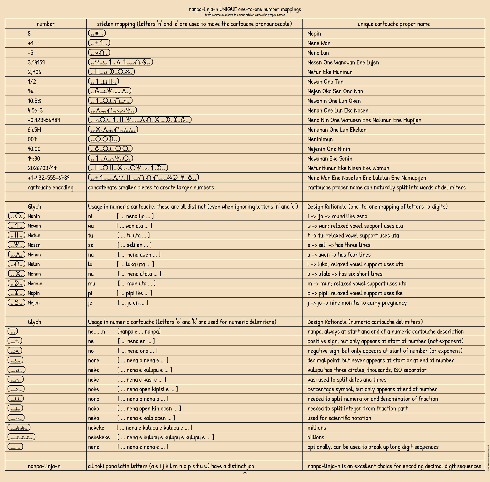


---

## Unique Numeric Codes:
Every decimal number can be encoded into a unique cartouche (and corresponding abbreviated cartouche).
The numeric cartouche can be spelled in Latin script as a unique nanpa-linja-n proper name for the number.
The proper name for the number can be used to communicate and reconstruct the original number.
The proper name for the number also gives a unique abbreviation for the number.


This gives us four (or five) uniquely decodable representations of the same underlying number: standard decimal notation, sitelen pona in a cartouche (or abbreviated cartouche), Latin pona proper name, and a unique numeric abbreviation.


Example:

<div style="
  border:1px solid #d0d7de;
  border-radius:6px;
  padding:12px;
  background:#f6f8fa;
  font-family: ui-monospace, SFMono-Regular, Menlo, Monaco, Consolas, 'Liberation Mono', 'Courier New', monospace;
  font-size: 0.95em;
  line-height: 1.6;
">
  -5,432.10 →<br>
  <span style="display:inline-flex; align-items:center; gap:8px; line-height:1;">
    <span style="font-size:1.4em; line-height:1;">#</span>
    
    <span style="line-height:1;">→</span>
  </span><br>
  nanpa Neno Lun Eke Nasetun One Wanin →<br>
  #~oLkASToWI →<br>
  -5,432.10
</div>


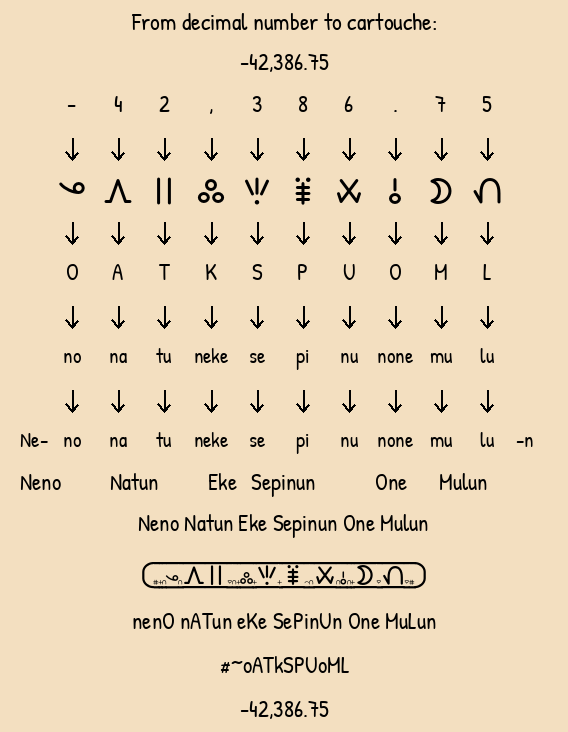<br/>
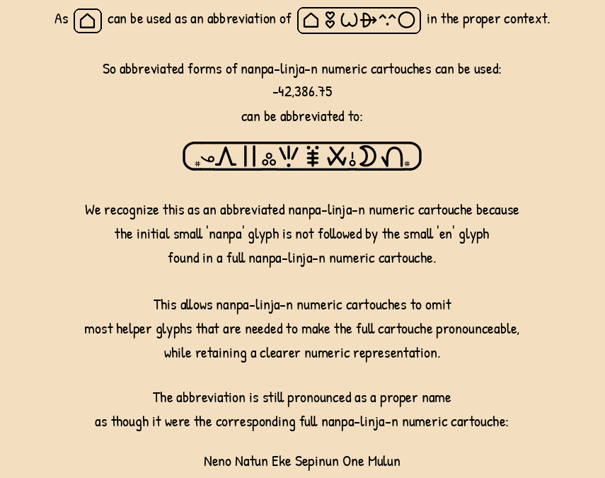<br/>
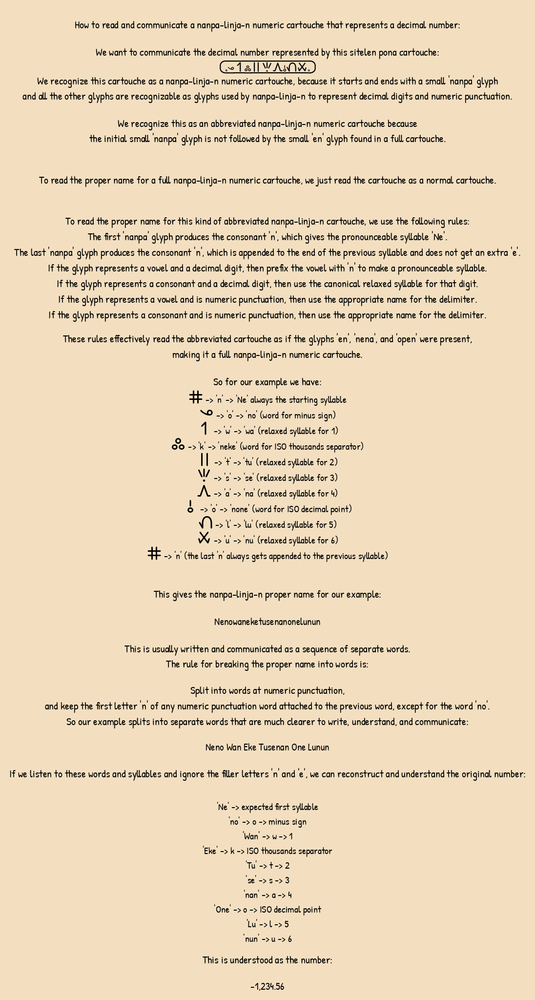<br/>
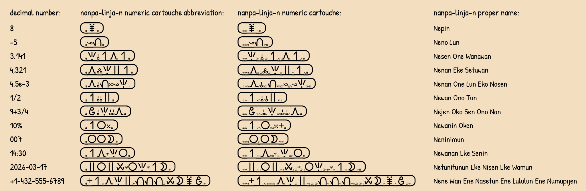<br/>


---

## General Number Rules
Applies to all numbers no matter what form they take.

Rules:

- All decimal numbers and digit sequences are encoded as nanpa-linja-n proper names and may be presented in sitelen pona as nanpa-linja-n numeric cartouches.
- All nanpa-linja-n numeric cartouches are read as nanpa-linja-n proper names corresponding to the encoded number, date, or time
- All nanpa-linja-n numeric cartouches will start with nanpa and end with nanpa
- All nanpa-linja-n numeric proper names derived from a cartouche will start with Ne- and end with -n
- General Latin nanpa-linja-n numeric proper name form: Ne...n
- General Numeric Cartouche form: [nanpa en ... nanpa]
- General Abbreviated Cartouche form: [nanpa ... nanpa]
- General Abbreviation #~ form: There is no general form used for all abbreviations, the letters 'n' and 'e' will never appear in any abbreviation form.
- Abbreviated cartouches are numeric cartouches with the interior words 'nena', 'en' and 'open' removed for clarity of rendering.
- Abbreviated cartouches are pronounced in exactly the same way as the corresponding full numeric cartouche, they only facilitate clearer rendering.
- A long nanpa-linja-n proper name will usually be split into separate words at numeric punctuation, each separate word will start with a capital letter
- The final -n is always appended to the final nanpa-linja-n proper name word.
- The letters i, w, t, s, a, l, u, m, p, and j are used to represent the digits 0, 1, 2, 3, 4, 5, 6, 7, 8, and 9, respectively, in nanpa-linja-n numeric cartouches, and the digits are represented in sitelen pona by the specific fixed glyphs ijo, wan, tu, seli, awen, luka, utala, mun, pipi and jo.
- The letters 'n' and 'e' are used in a nanpa-linja-n numeric cartouche to make the proper name derived from the cartouche more pronounceable and are represented in sitelen pona by various glyphs.
- The letters 'o' and 'k' are used in various combinations to represent numeric punctuation (decimal delimiters) and are represented in sitelen pona by various glyphs.
- When rendering the sitelen pona form of a nanpa-linja-n numeric cartouche, glyphs are displayed at different font sizes to reflect their relative significance within the overall numeric representation.
- A note on the pronunciation of nanpa-linja-n proper names: we assume that any “n” inside a word is pronounced with the vowel that follows it. For example, the proper name “Newenaten” for 142 is pronounced “Ne-we-na-ten”. This makes the syllable boundaries for each digit clear.


Example:

- -1,530.9 → Neno Wan Eke Lusenin One Jen (pronounced Ne-no-Wan-Eke-Lu-se-nin-One-Jen)

---

## Word-Splitting Rules for Numeric Proper Names

- Long nanpa-linja-n numeric proper names may be split into separate words at numeric punctuation markers to make them easier to read and communicate, each separate word will start with a capital letter.
- All numeric punctuation markers begin with **n**. When a punctuation marker is split into a separate word, its initial **n** is normally attached to the end of the preceding word.
- For example, the decimal separator **none** is split as **-n One**:
  - 2.5 → Netunonelun
  -  Split form: Netun One Lun
- The only exception is **no**, the negative marker. Since **no** represents the negative sign and can only appear at the start of a number or exponent, it is not split as **-n O**. It may attach to the **Ne-** at the start of a proper name to give **Neno**
- For example:
  - -1 → Nenowan
  -  Split form: Neno Wan
- The final **-n** is always attached to the final word of the full nanpa-linja-n proper name.

---

## nanpa-linja-n mode used for parsing and rendering of numeric proper names

These tables show which syllables may represent each decimal digit when parsing or rendering a nanpa-linja-n proper name.

In **strict mode**, each digit has only one accepted syllable. For example, digit 1 uses **we**, digit 2 uses **te**, and digit 5 uses **le**.

In **relaxed mode**, some digits can also use additional syllables that represent the same digit. For example, digit 1 can use **we** or **wa**, digit 2 can use **te** or **tu**, and digit 5 can use **le** or **lu**.

The **e**, **a**, **i**, and **u** columns show the nanpa-linja-n glyphs for the supporting vowel used in some digit syllables.

For **ni**, **na**, and **nu**, the supporting consonant is represented in nanpa-linja-n by the sitelen pona glyph *nena*.

The **large glyph** column shows the main sitelen pona glyph used for that digit. The **small glyph** row shows the small supporting glyph associated with each vowel column.

In relaxed mode, for example, **Nemun**, as well as **Nemen**, is accepted as representing the number 7.

Relaxed mode is preferred because it allows some digits to be represented using more natural syllables. For example, relaxed mode accepts both **Nemen** and **Nemun** as proper names representing the number 7. The additional permitted syllables are derived naturally from the sitelen pona glyph associated with the corresponding digit.


### relaxed

| digit | e | a | i | u | large glyph | sitelen glyphs | abbreviated |
| ----: | :-: | :-: | :-: | :-: | :---------- | :-------------: | :-----------: |
| 0 | - | - | ni | - | ijo |  | 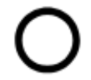 |
| 1 | we | wa | - | - | wan | 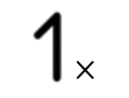 | 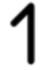 |
| 2 | te | - | - | tu | tu |  | 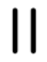 |
| 3 | se | - | - | - | seli |  |  |
| 4 | - | na | - | - | awen |  | 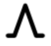 |
| 5 | le | - | - | lu | luka | 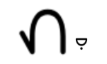 | 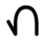 |
| 6 | - | - | - | nu | utala |  |  |
| 7 | me | - | - | mu | mun | 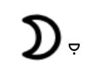 | 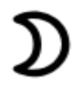 |
| 8 | pe | - | pi | - | pipi | 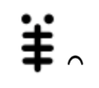 | 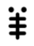 |
| 9 | je | - | - | - | jo | 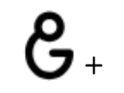 | 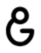 |
| small glyph | en | ala | ike | uta | &nbsp; | &nbsp; | &nbsp; |
| small sitelen glyph |  |  | 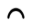 | 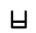 | &nbsp; | &nbsp; | &nbsp; |

### strict

| digit | e | a | i | u | large glyph | sitelen glyphs | abbreviated |
| ----: | :-: | :-: | :-: | :-: | :---------- | :-------------: | :-----------: |
| 0 | - | - | ni | - | ijo | 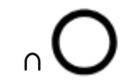 |  |
| 1 | we | - | - | - | wan |  |  |
| 2 | te | - | - | - | tu | 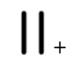 |  |
| 3 | se | - | - | - | seli |  |  |
| 4 | - | na | - | - | awen | 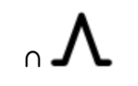 |  |
| 5 | le | - | - | - | luka | 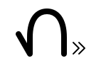 |  |
| 6 | - | - | - | nu | utala | 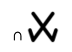 |  |
| 7 | me | - | - | - | mun | 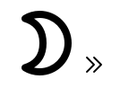 |  |
| 8 | pe | - | - | - | pipi | 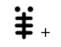 |  |
| 9 | je | - | - | - | jo |  |  |
| small glyph | en | &nbsp; | &nbsp; | &nbsp; | &nbsp; | &nbsp; | &nbsp; |
| small sitelen glyph |  | &nbsp; | &nbsp; | &nbsp; | &nbsp; | &nbsp; | &nbsp; |

### numeric punctuation

| numeric punctuation | nanpa-linja-n proper name letters | glyph sequence | sitelen glyphs | abbreviated |
| :------------------ | :-------------------------------- | :------------- | :-------------: | :-----------: |
| negative | `no` | `nena ona` | 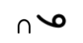 | 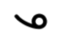 |
| decimal point | `none` | `nena o nena en` | 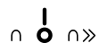 |  |
| ISO thousands | `neke` | `nena en kulupu en` | 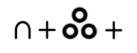 |  |
| percentage | `noke` | `nena open kipisi en` | 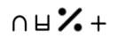 |  |
| scientific notation | `neko` | `nena en kala open` | 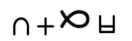 | 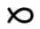 |
| numerator vs denominator | `nono` | `nena o nena o` |  |  |
| integer vs fraction | `noko` | `nena open kin open` | 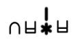 |  |
| date | `neke` | `nena en kasi en` | 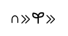 |  |
| time | `neke` | `nena en kasi en` |  | 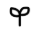 |
| spacer (no value) | `nene` | `nena en nena en` | 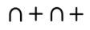 |  <small>(optional)</small> |


---

## Digit 0 Rule

Rules:

- Each digit has a unique sitelen pona glyph and a unique latin letter: 0 → ijo → i
- Latin nanpa-linja-n numeric proper name: ...ni...
- Numeric Cartouche [... nena ijo ...]
- Abbreviated Cartouche: [... ijo ...]
- Abbreviation #~: ...I...

Example:

- 0
- Nenin
- [nanpa en nena ijo nanpa]
- [nanpa ijo nanpa]
- Abbreviation: #~I

---

## Digit 1 Rule

Rules:

- Each digit has a unique sitelen pona glyph and a unique latin letter: 1 → wan → w
- Latin nanpa-linja-n numeric proper name: ...wa...
- Numeric Cartouche [... wan ala ...]
- Abbreviated Cartouche: [... wan ...]
- Abbreviation #~: ...W...

Example:

- 1
- Newan
- [nanpa en wan ala nanpa]
- [nanpa wan nanpa]
- Abbreviation: #~W

---

## Digit 2 Rule

Rules:

- Each digit has a unique sitelen pona glyph and a unique latin letter: 2 → tu → t
- Latin nanpa-linja-n numeric proper name: ...tu...
- Numeric Cartouche [... tu uta ...]
- Abbreviated Cartouche: [... tu ...]
- Abbreviation #~: ...T...

Example:

- 2
- Netun
- [nanpa en tu uta nanpa]
- [nanpa tu nanpa]
- Abbreviation: #~T

---

## Digit 3 Rule

Rules:

- Each digit has a unique sitelen pona glyph and a unique latin letter: 3 → seli → s
- Latin nanpa-linja-n numeric proper name: ...se...
- Numeric Cartouche [... seli en ...]
- Abbreviated Cartouche: [... seli ...]
- Abbreviation #~: ...S...

Example:

- 3
- Nesen
- [nanpa en seli en nanpa]
- [nanpa seli nanpa]
- Abbreviation: #~S

---

## Digit 4 Rule

Rules:

- Each digit has a unique sitelen pona glyph and a unique latin letter: 4 → awen → a
- Latin nanpa-linja-n numeric proper name: ...na...
- Numeric Cartouche [... nena awen ...]
- Abbreviated Cartouche: [... awen ...]
- Abbreviation #~: ...A...

Example:

- 4
- Nenan
- [nanpa en nena awen nanpa]
- [nanpa awen nanpa]
- Abbreviation: #~A

---

## Digit 5 Rule

Rules:

- Each digit has a unique sitelen pona glyph and a unique latin letter: 5 → luka → l
- Latin nanpa-linja-n numeric proper name: ...lu...
- Numeric Cartouche [... luka uta ...]
- Abbreviated Cartouche: [... luka ...]
- Abbreviation #~: ...L...

Example:

- 5
- Nelun
- [nanpa en luka uta nanpa]
- [nanpa luka nanpa]
- Abbreviation: #~L

---

## Digit 6 Rule

Rules:

- Each digit has a unique sitelen pona glyph and a unique latin letter: 6 → utala → u
- Latin nanpa-linja-n numeric proper name: ...nu...
- Numeric Cartouche [... nena utala ...]
- Abbreviated Cartouche: [... utala ...]
- Abbreviation #~: ...U...

Example:

- 6
- Nenun
- [nanpa en nena utala nanpa]
- [nanpa utala nanpa]
- Abbreviation: #~U

---

## Digit 7 Rule

Rules:

- Each digit has a unique sitelen pona glyph and a unique latin letter: 7 → mun → m
- Latin nanpa-linja-n numeric proper name: ...mu...
- Numeric Cartouche [... mun uta ...]
- Abbreviated Cartouche: [... mun ...]
- Abbreviation #~: ...M...

Example:

- 7
- Nemun
- [nanpa en mun uta nanpa]
- [nanpa mun nanpa]
- Abbreviation: #~M

---

## Digit 8 Rule

Rules:

- Each digit has a unique sitelen pona glyph and a unique latin letter: 8 → pipi → p
- Latin nanpa-linja-n numeric proper name: ...pi...
- Numeric Cartouche [... pipi ike ...]
- Abbreviated Cartouche: [... pipi ...]
- Abbreviation #~: ...P...

Example:

- 8
- Nepin
- [nanpa en pipi ike nanpa]
- [nanpa pipi nanpa]
- Abbreviation: #~P

---

## Digit 9 Rule

Rules:

- Each digit has a unique sitelen pona glyph and a unique latin letter: 9 → jo → j
- Latin nanpa-linja-n numeric proper name: ...je...
- Numeric Cartouche [... jo en ...]
- Abbreviated Cartouche: [... jo ...]
- Abbreviation #~: ...J...

Example:

- 9
- Nejen
- [nanpa en jo en nanpa]
- [nanpa jo nanpa]
- Abbreviation: #~J

---

## Multi-Digit Rule

Rules:

- To represent a multi-digit number in a cartouche just concatenate the single digit representations
- Latin nanpa-linja-n numeric proper name: ...jese...
- Numeric Cartouche [... jo en seli en ...]
- Abbreviated Cartouche: [... jo seli ...]
- Abbreviation #~: ...JS...
- A long nanpa-linja-n proper name will usually be split into separate words at numeric punctuation
- A useful convenience is that exact hundreds can be split into separate words: 200 → Neten Inin

### Examples

- 10 → we ni → **Newanin**
- 46 → na nu → **Nenanun**
- 78 → me pe → **Nemepin**
- 100 → we ni ni → **Newaninin**
- 100 → we ni ni → **Newan Inin**
- 567 → le nu me → **Nelunumun**
- 234 → te se na → **Netusenan**
- 801 → pe ni we → **Nepiniwan**
- 950 → je le ni → **Nejelunin**


### More Examples
```
1           → Newan
10          → Newanin
100         → Newan Inin
1,000       → Newan Eken
10,000      → Newanin Eken
100,000     → Newan Inin Eken
1,000,000   → Newan Ekeken
08          → Nenipin
23          → Netusen
679         → Nenumujen
1,234       → Newan Eke Tusenan
12,000      → Newatun Eken
12000       → Newatunininin
3,000,000   → Nesen Ekeken
30,000,000  → Nesenin Ekeken
300,000,000 → Neseninin Ekeken
3,000,000,000 → Nesen Ekekeken
7,321,900   → Nemun Eke Setuwan Eke Jeninin
64.5M       → Nenunan One Lun Ekeken
64.5B       → Nenunan One Lun Ekekeken
0123456789  → Neniwatusenalunumupijen (using block words is optional, but often very helpful for understanding)
012-3456789 → Neniwatun Ene Senalunumupijen (nene can be used anywhere to break up large numbers)
012-3456-789 → Neniwatun Ene Senalunun Ene Mupijen
2025        → Netunitulun
2,025       → Netun Eke Nitulun
20-25       → Netunin Ene Tulun
2-0-2-5     → Netun Ene Nin Ene Tun Ene Lun
3.141592    → Nesen One Wanawalujetun
−5          → Neno Lun
1/2         → Newan Ono Tun
9¾          → Nejen Oko Sen Ono Nan
10.5%       → Newanin One Lun Oken
4.5*10^-3   → Nenan One Lun Eko Wanin Eko Nosen
```

---

## Negative Numbers — no
Prefix **no** indicates a negative number

Rules:

- Latin nanpa-linja-n numeric proper name: ...no...
- Numeric Cartouche [... nena ona ...]
- Abbreviated Cartouche: [... ona ...]
- Abbreviation #~: o...
- the negative indicator ...no... must only appear at the start of a number or exponent

Word-splitting:

- **no** does not split as **-n O**.
- Since **no** marks the negative sign, it may attach to the **Ne-** at the start of a proper name to give **Neno**
- Example: -1 → Nenowen → Neno Wen
- Example: 1e-3 → Newenekoweninekonosen → Newen Eko Wenin Eko Nosen

Examples:

```
−5         → Neno Len
−12        → Neno Weten
−0.4       → Neno Nin One Nan
−30,000    → Neno Senin Eken
-4.5e-3    → Neno Nan One Len Eko Wenin Eko Nosen
```

---

## Decimal Separator — none
**none** separates whole and decimal parts.

Rules:

- Latin nanpa-linja-n numeric proper name: ...none...
- Numeric Cartouche: [... nena o nena en ...]
- Abbreviated Cartouche: [... o ...]
- Abbreviation #~: ...o...
- There must always be at least one digit before and after the decimal separator.

Word-splitting:

- **none** may split as **-n One**.
- Example: 2.5 → Netenonelen → Neten One Len

Examples:

```
0.5       → Nenin One Len
3.75      → Nesen One Melen
12.04     → Neweten One Ninan
37.9      → Nesemen One Jen
0.125     → Nenin One Wetelen
3.141592  → Nesen One Wenawen Ene Lejeten
```

---

## ISO Thousands Blocks — neke
**neke** indicates ISO thousands blocks.

Rules:

- Latin nanpa-linja-n numeric proper name: ...neke...
- Numeric Cartouche: [... nena en kulupu en ...]
- Abbreviated Cartouche: [... kulupu ...]
- Abbreviation #~: ...k...
- If the numeric value ends in full blocks of thousands, the proper name can end with **... Eken**, **... Ekeken**, or **... Ekekeken**, depending on the number of full ISO thousands blocks at the end of the value.

Word-splitting:

- **neke** may split as **-n Eke**.
- Example: 1,234 → Neweneketesenan → Newen Eke Tesenan

Examples:

```
1,234       → Newen Eke Tesenan
12,000      → Neweten Eken
3,000,000   → Nesen Ekeken
30,000,000  → Nesenin Ekeken
300,000,000 → Neseninin Ekeken
3,000,000,000 → Nesen Ekekeken
7,321,900   → Nemen Eke Setewen Eke Jeninin
```

---

## Fractions — nono
**nono** separates the numerator and denominator of a numeric fraction.

Rules:

- Latin nanpa-linja-n numeric proper name: ...nono...
- Numeric Cartouche: [... nena o nena o ...]
- Abbreviated Cartouche: [... oo ...]
- Abbreviation #~: ...oo...
- If a fraction is negative, the negative sign appears at the very start of the whole fraction expression.

Word-splitting:

- **nono** may split as **-n Ono**.
- Example: 1/2 → Newenonoten → Newen Ono Ten

Examples:

```
1/2                 → Newen Ono Ten
3/4                 → Nesen Ono Nan
5/8                 → Nelen Ono Pen
567/890             → Nelenumen Ono Pejenin
1,234 / 56          → Newen Eke Tesenan Ono Lenun
3 / 1,000,000,000   → Nesen Ono Wen Ekekeken
-7/9                → Neno Men Ono Jen
```

---

## Fractions — noko
**noko** separates the integer part from the fraction part of a mixed numeric fraction.

Rules:

- Latin nanpa-linja-n numeric proper name: ...noko...
- Numeric Cartouche: [... nena open kin open ...]
- Abbreviated Cartouche: [... kin ...]
- Abbreviation #~: ...oko...
- If a mixed fraction is negative, the negative sign appears at the very start of the whole mixed fraction expression.

Word-splitting:

- **noko** may split as **-n Oko**.
- Example: 9¾ → Nejenokosenononan → Nejen Oko Sen Ono Nan

Examples:

```
9¾                  → Nejen Oko Sen Ono Nan
-8+1/2              → Neno Pen Oko Wen Ono Ten
```


---

## Percentages — noke
**noke** expresses percentages.

Rules:

- Latin nanpa-linja-n numeric proper name: ...noke...
- Numeric Cartouche: [... nena open kipisi en ...]
- Abbreviated Cartouche: [... kipisi ...]
- Abbreviation #~: ...ok
- The percentage indicator always occurs at the end of the numeric expression, so it always receives the final **-n**.

Word-splitting:

- **noke** may split as **-n Oke**.
- Since **noke** occurs at the end of the numeric expression, the split form usually appears as **Oken**.
- Example: 5% → Nelenoken → Nelen Oken

Examples:

```
5%          → Nelen Oken
-8%         → Neno Pen Oken
10.5%       → Newenin One Len Oken
1000%       → Newenininin Oken
2,000%      → Neten Eken Oken
```

---

## Scientific Notation — neko
**neko** expresses scientific notation.

Rules:

- Latin nanpa-linja-n numeric proper name: ...nekowenineko...
- Numeric Cartouche: [... nena en kala open wan en nena ijo nena en kala open ...]
- Abbreviated Cartouche: [... kala wan ijo kala ...]
- Abbreviation #~: ...koWIko...
- The scientific notation indicator is used for both the “by 10” marker and the exponent marker.
- The exponent must be an integer.
- The abbreviation ...okoWIkoo... is treated as an integer-and-fraction encoding, not as scientific notation, because it cannot occur in valid scientific notation.

Word-splitting:

- **neko** may split as **-n Eko**.
- Example: 4.5e3 → Nenanonelenekoweninekosen → Nenan One Len Eko Wenin Eko Sen

Examples:

```
4.5*10^3    → Nenan One Len Eko Wenin Eko Sen
4.5*10+3    → Nenan One Len Eko Wenin Eko Sen
4.5e3       → Nenan One Len Eko Wenin Eko Sen
4.5e+3      → Nenan One Len Eko Wenin Eko Sen
4.5*10^-3   → Nenan One Len Eko Wenin Eko Nosen
4.5*10-3    → Nenan One Len Eko Wenin Eko Nosen
4.5e-3      → Nenan One Len Eko Wenin Eko Nosen
-4.5e-3     → Neno Nan One Len Eko Wenin Eko Nosen
```


---

## Date and Time Separator — neke
**neke** can also be used as a date/time separator.
The context will determine that we have a date or time cartouche.

Rules:

- Latin nanpa-linja-n numeric proper name: ...neke...
- Numeric Cartouche: [... nena en kasi en ...]
- Abbreviated Cartouche: [... kasi ...]
- Abbreviation #~: ...k...


Word-splitting:

- **neke** may split as **-n Eke**.
- Example: 12:00 → Newetenekeninin → Neweten Eke Ninin

Examples:

```
14:30       → Newenan Eke Senin
2026-03-17  → Netenitenun Eke Nisen Eke Wemen
```


---

## No value break — nene
**nene** has no numeric value and may be used to break up long sequences of decimal digits without affecting the value.

Rules:

- Latin nanpa-linja-n numeric proper name: ...nene...
- Numeric Cartouche: [... nena en nena en ...]
- Abbreviated Cartouche: omitted; **nene** has no visible abbreviated-cartouche form.
- Abbreviation #~: omitted; **nene** has no #~ abbreviation form, because the letters **n** and **e** never appear in abbreviated forms.
- **nene** is useful for communicating long digit sequences such as phone numbers, where natural breaks can be represented without changing the numeric value.

Word-splitting:

- **nene** may split as **-n Ene**.
- Example: 321-555-6789 → Nesetewenenelelelenenenumepejen → Nesetewen Ene Lelelen Ene Numepejen

Examples:

```
321-555-6789  → Nesetewen Ene Lelelen Ene Numepejen
3.141592      → Nesen One Wenawen Ene Lejeten
```


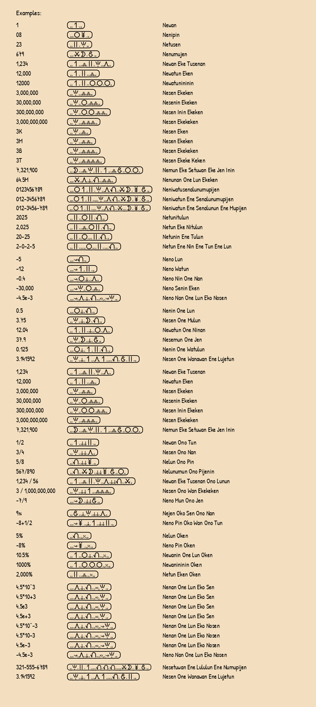<br/>

---


## Reference Counting Table

You can calculate the nanpa-linja-n proper name for any number using this [renderer](https://www.nanpa-linja-n.com/renderer.html).  It also displays the number as a sitelen pona cartouche and provides an audio pronunciation.

This table uses the rexaled versions of the digit syllables:

| Decimal number | nanpa-linja-n proper name |
| -------------: | ------------------------- |
|              0 | Nenin                     |
|              1 | Newan                     |
|              2 | Netun                     |
|              3 | Nesen                     |
|              4 | Nenan                     |
|              5 | Nelun                     |
|              6 | Nenun                     |
|              7 | Nemun                     |
|              8 | Nepin                     |
|              9 | Nejen                     |
|             10 | Newanin                   |
|             11 | Newawan                   |
|             12 | Newatun                   |
|              ⋮ | ⋮                         |
|             20 | Netunin                   |
|              ⋮ | ⋮                         |
|             30 | Nesenin                   |
|              ⋮ | ⋮                         |
|             40 | Nenanin                   |
|              ⋮ | ⋮                         |
|             50 | Nelunin                   |
|              ⋮ | ⋮                         |
|             60 | Nenunin                   |
|              ⋮ | ⋮                         |
|             70 | Nemunin                   |
|              ⋮ | ⋮                         |
|             80 | Nepinin                   |
|              ⋮ | ⋮                         |
|             90 | Nejenin                   |
|              ⋮ | ⋮                         |
|             98 | Nejepin                   |
|             99 | Nejejen                   |
|            100 | Newan Inin                |
|            101 | Newaniwan                 |
|            102 | Newanitun                 |
|              ⋮ | ⋮                         |
|            200 | Netun Inin                |
|              ⋮ | ⋮                         |
|            300 | Nesen Inin                |
|              ⋮ | ⋮                         |
|            400 | Nenan Inin                |
|              ⋮ | ⋮                         |
|            500 | Nelun Inin                |
|              ⋮ | ⋮                         |
|            600 | Nenun Inin                |
|              ⋮ | ⋮                         |
|            700 | Nemun Inin                |
|              ⋮ | ⋮                         |
|            800 | Nepin Inin                |
|              ⋮ | ⋮                         |
|            900 | Nejen Inin                |
|              ⋮ | ⋮                         |
|            998 | Nejejepin                 |
|            999 | Nejejejen                 |
|          1,000 | Newan Eken                |
|          1,001 | Newan Eke Niniwan         |
|              ⋮ | ⋮                         |
|          1,100 | Newan Eke Wan Inin        |
|          1,101 | Newan Eke Waniwan        |
|              ⋮ | ⋮                         |
|          1,200 | Newan Eke Tun Inin        |
|              ⋮ | ⋮                         |
|          2,000 | Netun Eken                |
|              ⋮ | ⋮                         |
|          2,100 | Netun Eke Wan Inin        |
|              ⋮ | ⋮                         |
|          3,000 | Nesen Eken                |
|              ⋮ | ⋮                         |
|          4,000 | Nenan Eken                |
|              ⋮ | ⋮                         |
|          5,000 | Nelun Eken                |
|              ⋮ | ⋮                         |
|          6,000 | Nenun Eken                |
|              ⋮ | ⋮                         |
|          7,000 | Nemun Eken                |
|              ⋮ | ⋮                         |
|          8,000 | Nepin Eken                |
|              ⋮ | ⋮                         |
|          9,000 | Nejen Eken                |
|              ⋮ | ⋮                         |
|          9,998 | Nejen Eke Jejepin         |
|          9,999 | Nejen Eke Jejejen         |
|         10,000 | Newanin Eken              |
|         10,001 | Newanin Eke Niniwan       |
|              ⋮ | ⋮                         |
|         20,000 | Netunin Eken              |
|              ⋮ | ⋮                         |
|         30,000 | Nesenin Eken              |
|              ⋮ | ⋮                         |
|         40,000 | Nenanin Eken              |
|              ⋮ | ⋮                         |
|         50,000 | Nelunin Eken              |
|              ⋮ | ⋮                         |
|         60,000 | Nenunin Eken              |
|              ⋮ | ⋮                         |
|         70,000 | Nemunin Eken              |
|              ⋮ | ⋮                         |
|         80,000 | Nepinin Eken              |
|              ⋮ | ⋮                         |
|         90,000 | Nejenin Eken              |
|              ⋮ | ⋮                         |
|         100,000 | Newan Inin Eken              |
|         100,001 | Newan Inin Eke Niniwan              |
|              ⋮ | ⋮                         |
|        200,000 | Netun Inin Eken           |
|              ⋮ | ⋮                         |
|        300,000 | Nesen Inin Eken           |
|              ⋮ | ⋮                         |
|        400,000 | Nenan Inin Eken           |
|              ⋮ | ⋮                         |
|        500,000 | Nelun Inin Eken           |
|              ⋮ | ⋮                         |
|        600,000 | Nenun Inin Eken           |
|              ⋮ | ⋮                         |
|        700,000 | Nemun Inin Eken           |
|              ⋮ | ⋮                         |
|        800,000 | Nepin Inin Eken           |
|              ⋮ | ⋮                         |
|        900,000 | Nejen Inin Eken           |
|              ⋮ | ⋮                         |
|        999,999 | Nejejejen Eke Jejejen |
|      1,000,000 | Newan Ekeken                    |
|      1,000,001 | Newan Eke Nininin Eke Niniwan |


---

## Design Rationale

### Digit Roots
- Unique syllables
- Easy to remember and use
- Very useful when speaking and hearing long sequences of digits ( 5201 → Neleteniwen → 5201 )
- End in **-n** for structural consistency, for long digit sequences the end is clearly signaled
  - The speaker wants to communicate **"1 2 3 4 5"**:
    - for counting,
      - might say: **"Newen Neten Nesen Nenan Nelen"**
    - for value 12,345,
      - might say: **"Neweten Eke Senalen"**
    - for sequence of digits, like an id,
      - might say: **"Newetesenalen"**
    - for 1-2-3-4-5 digit emphasis,
      - might say: **"Newen Ene Ten Ene Sen Ene Nan Ene Len"**
    - for breaking up long sequences with no change in value, (nene can be used anywhere)
      - might say: **"Neweten Ene Senalen"**
    - In all cases the listener has understood the speaker as communicating **"12345"**
  - Screen readers can communicate longer digit sequences with less cognitive load
  - Automated text-to-speech systems can communicate longer digit sequences with less cognitive load
  - Can enhance compatability with [WCAG 2.2](WCAG%202.2%20compliance%20claims.md)
- No conflict with Toki Pona vocabulary
- Where possible, respects the first letter of existing Toki Pona digit names (from pu)
- By starting digit sequences with **Ne-** and ending digit sequences with **-n**, words are more easily identified as **nanpa-linja-n** proper names for digit sequences ( Nemetesen → 723 )
- Respects the speaker’s freedom to choose how to express numbers:
  - Additive (**pu** style) numerals:
    - The speaker uses **pu** names ala, wan, tu, luka, mute, ale
    - The speaker thinks: 78 = 20 add 20 and 20 and 5 and 5 and 5 and 2 and 1
    - The speaker says (the way they think): mute mute mute luka luka luka tu wan
    - The listener recognises **pu** semantics
    - The listener understands: 78
  - Positional decimal (**nanpa-linja-n** style) strings:
    - The speaker uses **nanpa-linja-n** digit names with concatenation and **Ne-** signalling the start and **-n** signalling the end of the string of digits
    - The speaker thinks: 78 = 7 followed by 8
    - The speaker says (the way they think): Nemepen
    - The listener recognises **nanpa-linja-n** semantics (since no word collision and syntax is consistent)
    - The listener understands: "78"
    - The listener may understand that "78" represents a numeric value, but that understanding is determined by context
  - Any system that groups digits before speaking adds cognitive load for the speaker, because they must pre-determine consistent groupings before saying anything.  **nanpa-linja-n** works with the ISO conventional digit separators using "n Eke " / "n Eken"
  - By contrast, speaking one digit at a time lets the speaker break long sequences anywhere without losing meaning.  **nanpa-linja-n** can break large strings of digits up using "n Ene ", without assuming that the string of digits represents a numeric value
- Can be used as a drop-in replacement for (base 10) digits in dates, times, phone numbers, codes, and any context where precise digit information is needed
- (Can be easily parsed with lex/yacc)
- (Yet another humble attempt at simply being functional, avoiding copy and paste and cognitive load)


---

## Arithmetic Operations
Here we are moving away from describing numbers to describing simple arithmetic expressions.
This is not the main focus of this proposal.
None of what follows, in this section, is part of the nanpa-linja-n proposal only suggestions.
Some of the suggestions below are inspired by [seximal] nasin nanpa suli, tan jan Emalan.
They never appear in a numeric cartouche.
Words primarialy chosen for the shape of their sitelen pona glyphs.
In numeric expressions the word 'nanpa' can appear once at the start as 'nanpa la'.
The Toki Pona expression 'li sama' has an unfortunate sitelen pona appearance identical to '>=', so 'li' should be left out of sentences about numeric expressions.

### Equals: sama
- Shape of sitelen pona glyph (looks like equals)
- Good candidate
- Never appears in a numeric cartouche
- Example: nanpa la zz Nenin One Len sama Newen Ono Ten

### Addition: en
- Shape of sitelen pona glyph (looks like plus)
- Good candidate
- Adds more context, makes the assumption that the strings of digits represent numeric values
- Never appears in a numeric cartouche
- Example: nanpa la zz Newen en Neten en Nesen sama Nenun

### Subtract: lape
- Shape of sitelen pona glyph (looks like subtract)
- Good candidate
- Adds more context, makes the assumption that the strings of digits represent numeric values
- Never appears in a numeric cartouche (but negative symbol can appear in a numeric cartouche)
- Example: nanpa la zz Nesen lape Nenoten sama Nelen

### Multiply: lete
- Shape of sitelen pona glyph (looks like multiply in ascii)
- Good candidate
- Adds more context, makes the assumption that the strings of digits represent numeric values
- Never appears in a numeric cartouche
- Example: nanpa la zz Nesen lete Neten sama Nenun

### Division: kipisi
- Shape of sitelen pona glyph (looks like divide)
- Good candidate
- Adds more context, makes the assumption that the strings of digits represent numeric values
- Never appears in a numeric cartouche (but fraction symbol can appear in a numeric cartouche)
- Example: nanpa la zz Nepen kipisi Nenoten sama Nenonan

### Power: sewi
- Shape of sitelen pona glyph (looks like rising up)
- Good candidate
- Adds more context, makes the assumption that the strings of digits represent numeric values
- Never appears in a numeric cartouche
- Example: nanpa la zz Neten sewi Nesen sama Nepen

### Root: lili
- Shape of sitelen pona glyph (looks like small part of)
- Good candidate
- Adds more context, makes the assumption that the strings of digits represent numeric values
- Never appears in a numeric cartouche
- Example: nanpa la zz Nesen lili Nepen sama Neten

### Log: anpa
- Shape of sitelen pona glyph (looks like below)
- Good candidate
- Adds more context, makes the assumption that the strings of digits represent numeric values
- Never appears in a numeric cartouche
- Example: nanpa la zz Nepen anpa Neten sama Nesen


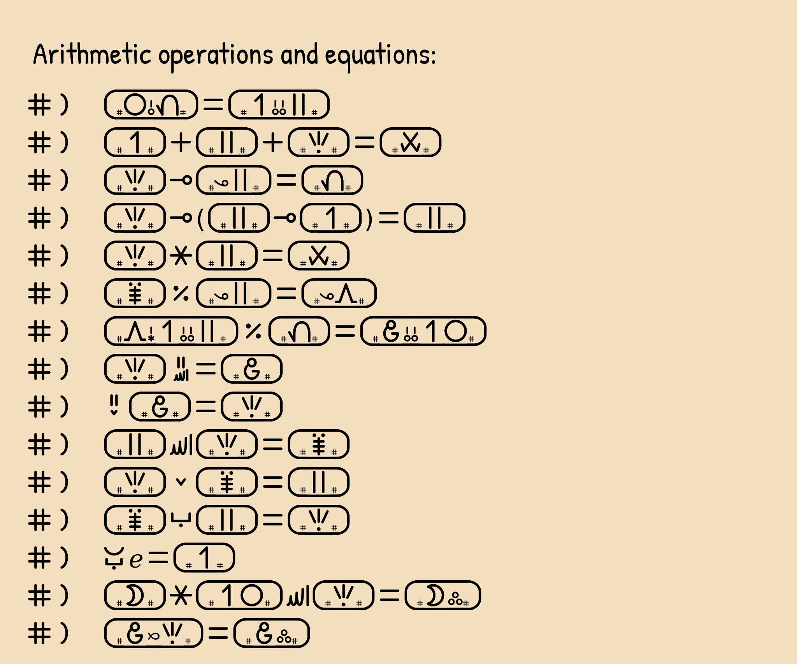<br/>


Other mathematical expressions (and maybe even powers, roots and logs) are better left in mathematical notation:

cos(2π) = 1

√9 = 3

and have the community calque what are useful ways to describe these expressions


---

## License
This project is licensed under the Creative Commons Attribution 4.0 International License (CC BY 4.0).

See the LICENSE file for details.

---

## Exercises
Have someone read the nanpa-linja-n sentences in the [examples](examples.md), and check how many of them you can correctly understand.

This demonstrates the motivation behind this number system.

Use other Toki Pona number systems, that you know, to expresss the sentences in the [examples](examples.md) and compare with **nanpa-linja-n** for ease of listening effort and understanding.  When seeing a (decimal) number for the first time, how much mental effort does the speaker have to exert in order to determine what the numeric description will be?  Do the number descriptions make the sentence harder to understand?  This feedback would be appreciated.

Use the [nanpa_linja_n_anki_examples.csv](nanpa_linja_n_anki_examples.csv) to build an Anki deck.

---

## Community & Contributions
Discussion welcome via:

- The 'Discussions' tab on this Github repository

- https://sona.pona.la/wiki/nasin_nanpa_linja_n (you need an account on sona pona to view this page)

- Comments on tokipona channel on Reddit (mention nanpa-linja-n in your posts, so its clear what subject your post is about)

- kama sano Discord: https://discord.com/channels/969386329513295872/1442150091816440000

- On [https://sona.pona.la/wiki/nasin_nanpa_ali_ike](https://sona.pona.la/wiki/nasin_nanpa_ali_ike#[decimal]_nanpa-linja-n) list, **nanpa-linja-n** looks most closest to (at first glance):

  - [decimal] socks numeral (based on cantonese), tan socks

  - [decimal] [humorous] kijetesantakalu polinpin, tan jan Kita (shameless self-promotion)

  - [decimal] nasin nanpa nimi, tan kijetesantakalu Iwan

  - [decimal] lojban, tan jan Tepo

  - Esperanto and Lojban

  - how **nanpa-linja-n** compares to these (at first glance):

    - it describes a string of digits, the context will determine if the string of digits represents a numeric value

    - it uses **ne-** at the start and **-n** at the end of the base name for the digits (CVN format), so that single digit names are consistent with the descriptions of other digit strings

    - it consistently uses **ne-** at the start and **-n** at the end of digit strings

    - it consistently uses **ne-** at the start and **-n** at the end of numerical structures that end with delimiters (eken/ekeken/ekekeken)

    - the consistent use of **ne-** at the start and **-n** at the end as morphological markers is original

    - the consistent use of **ne-** at the start and **-n** at the end makes it immediately clear when a string of digits stops, no matter how long the sequence of digits. The listener spends little mental effort deciding whether the digit sequence is complete, and context will determine if the digit sequence represents a numeric value

    - while using similar principles, it provides a more consistent way to express numbers — including large ones — reducing learning effort and cognitive load on both speaker and listener

---

## Bigger Picture

**nanpa-linja-n** can be considered part of a bigger Unicode project described here: [Unicode Discussion](toki%20pona%20bigger%20unicode%20picture.md)


---

## Libre Office Integration

**nanpa-linja-n** [font](./docs/fonts/nasin-nanpa-5.0.0-beta.3-UCSUR-nanpa-linja-n-good-kasi.otf) can be integrated with Libre Office.  This provides one way of displaying sitelen pona glyphs in documents.

This [Libre Office macro](./docs/fonts/libre%20office%20macro%20for%20inserting%20UCSUR%20hexcodes%20-%20run%20InsertHexCodepoints.txt) can be used to insert UCSUR codes into Libre Office Writer documents, using the font to display sitelen pona glyphs.

  - InsertHexCodepoints
    - Running this macro allows UCSUR code points to be inserted directly into Libre Office Writer documents and be displayed as sitelen pona glyphs.

  - InsertTokiPonaUcsur
    - Running this macro allows Toki Pona words to be inserted directly into Libre Office Writer documents and be displayed as sitelen pona glyphs.

  - ReplaceSelectionWithTokiPonaUcsur
    - Running this macro allows Toki Pona words to be used to edit/delete selected sitelen pona glyphs in Libre Office Writer documents.

  - Libre Office example using this font:
    - 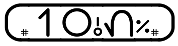


The [number renderer tool](https://www.nanpa-linja-n.com/renderer.html) provides an easy way to determine the UCSUR codes to use for Toki Pona words.


It is good practice to keep a copy of the Toki Pona latin words used to create the sitelen pona glyphs (in case the font is not available on the system that presents the document).

---


## toki musi pona

### musi nanpa

musi pi nanpa:

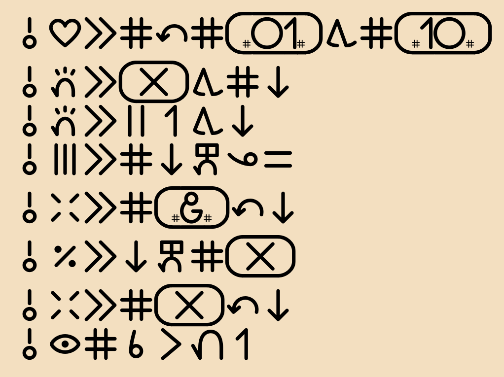

o lukin sona e nanpa:

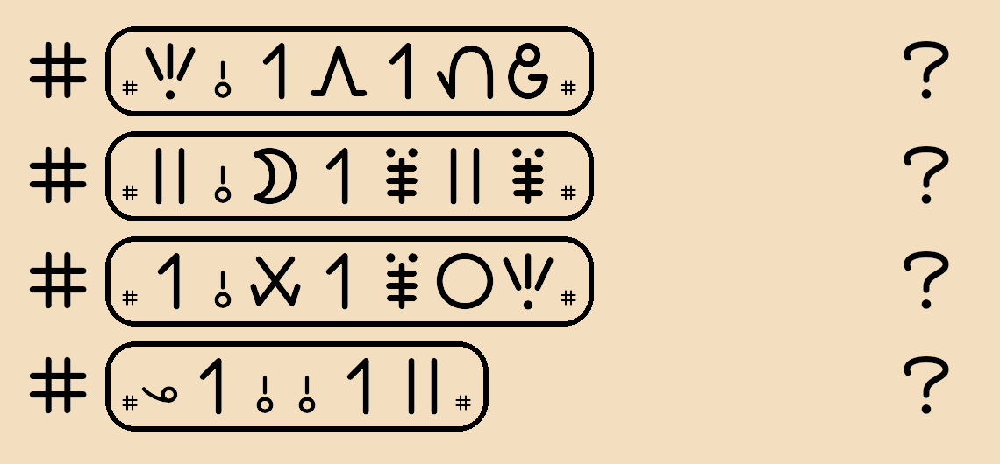

### musi sitelen


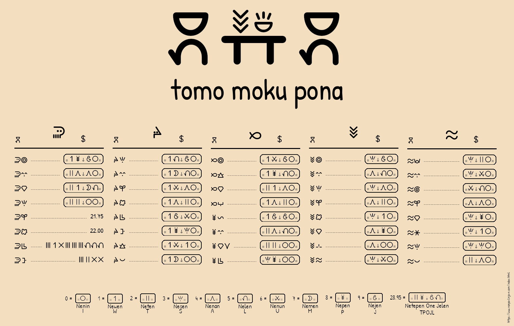


\#~n


